<!--
title: Firefox Relay Interaction Data
last_updated: June 2024
audience: end-users, developers
comment: This file is linked from the Relay Privacy Notice
linked_from: https://www.mozilla.org/en-US/privacy/subscription-services/
-->

# Firefox Relay Interaction Data

Firefox Relay records information about Relay users and how they use the service. This
document describes the recorded information and what we do with the information we
collect.

We collect information to **provide the service** and to **answer questions about
service usage**.

For example, to **provide the service** we store information such as:

- The Relay email masks and phone masks created by the Relay user. This is needed
  to associate a mask with the Relay user.
- The Relay user's Mozilla account, including their account email and their
  subscription level. This is needed to forward emails from their Relay mask to their
  true email address, and to enable premium features.

One part of the providing the service is to **catch bugs**. When something unexpected
happens, we capture the data needed to understand what happened. We avoid capturing
data that identifies the user. When necessary to fix the bug, we will include a
user identifier, like a database row number, that is only significant to the Relay team.

Other information is used to **answer questions about Relay usage**:

- Demographic:
  - From which country does the majority of our traffic originate?
  - Which browsers are most commonly used to access the Firefox Relay website?
  - Which devices are most commonly used to access the Firefox Relay website?
  - Which browser is running the Firefox Relay the add-on?
- User Behavior:
  - Do users delete aliases?
  - Do users create aliases?
  - How do users create aliases? From the Relay website dashboard? The context menu? The
    input icon?
  - Do users change the forwarding settings for their aliases?
  - Do users choose to install the Relay Extension?
  - Do users interact with the Relay extension panel?
  - When do users decide to upgrade to Premium?
  - How many email masks are created? What is the distribution of daily
    mask creation across users? Are there outliers who create many masks?
  - How many emails are forwarded? What is the distribution of daily email
    forwarding by count and email size? Are there outliers who forward many
    emails or very large emails?

# Metrics Collection and Data Storage

The Firefox Relay service is split into an API for interactive use, and a mask
processing service to handle email and phone masks.

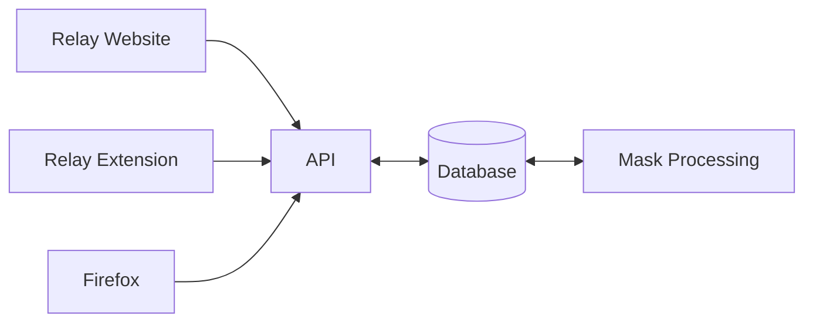
```mermaid
graph LR
API <--> DB[(Database)]
    DB <--> MP[Mask Processing]
    W[Relay Website] --> API
    RE[Relay Extension] --> API
    F[Firefox] --> API
```

For information about data collected by Firefox, see the [Firefox Privacy Notice][].

Relay uses several methods to collect and store information:

- **Google Analytics** (third-party) - In the Relay website and extension, to measure
  usage.
- **Stripe** (third-party) - In the Relay website, to detect fraud.
- **Cookies** - In the Relay website and the API, to measure usage and provide
  the service.
- **The Relay Database** - In the API and mask processing, to provide the service,
  to enable features for some users, and to measure usage.
- **Statd-style statistics** - In the API and mask processing, to measure usage.
- **Server Logs** - In the API and mask processing, to provide the service,
  capture bugs, and measure usage.
- **Sentry** - In the API and mask processing, to capture bugs.
- **Glean metrics** - In the API and mask processing, to measure usage.

[Firefox Privacy Notice]: https://www.mozilla.org/en-US/privacy/firefox/

## Opt Out of Metrics Collection and Data Storage

The are a few ways to opt out of metrics and data storage.

A Relay user can **turn off data collection** on their [Mozilla account settings][].
Under "Data Collection and Use", turn off "Help improve Mozilla accounts". When this
setting is off:

- Google Analytics is not loaded on the Relay website
- Glean metrics are disabled on the Relay website, the Relay extension, and mask
  processing.
- The user's identifiers are omitted from server logs and enhanced bug captures.

A website visitor can **turn on the DNT header** (see
[How do I turn on the Do Not Track feature?][]). When a DNT header is enabled,
Google Analytics is not loaded on the Relay website, and collects no data for that
session.

A Relay user can **disable account names for email masks** on their [Relay settings][].
This will clear labels and associated websites for email masks in the Relay database.
This will disable features that suggest an email mask previously used on a website.

A Relay user with the phone subscription can **disable caller and text logs** on
their [Relay settings][]. This will disable the ability to respond to text messages.

[Mozilla account settings]: https://accounts.firefox.com/settings
[Relay settings]: https://relay.firefox.com/accounts/settings/
[How do I turn on the Do Not Track feature?]: https://support.mozilla.org/en-US/kb/how-do-i-turn-do-not-track-feature

# Google Analytics

[Google Analytics][] is a web analytics service that tracks and reports website traffic
and events. Relay uses it on the Relay website to track traffic and events, and in the
Relay extension to track usage. Relay user identifiers are not included in Google
Analytics traffic.

Website visitors can disable Google Analytics by turning on the DNT header in
their browser. Relay user can disable Google Analytics by turning off data collection in
their Mozilla account. See [Opt Out of Metrics Collection and Data Storage][] for more
information. Google Analytics can also be disabled by many popular privacy and security
extensions.

Relay uses Universal Analytics, the third version of Google Analytics. Google has
[replaced Universal Analytics with Google Analytics 4][] (GA4). Relay is in the process
of switching to [GA4][].

[Opt Out of Metrics Collection and Data Storage]: #opt-out-of-metrics-collection-and-data-storage
[Google Analytics]: https://en.wikipedia.org/wiki/Google_Analytics
[replaced Universal Analytics with Google Analytics 4]: https://support.google.com/analytics/answer/11583528
[GA4]: https://developers.google.com/analytics/devguides/collection/ga4

## Website Event Collection

The website uses the GA4 [Measurement Protocol][], but is still using the
data structure of the [Universal Measurement Protocol][]. This will change as we adapt to
[changes in GA4 data model][].

A Google Analytics metric is called a "hit". The two main hit types are a page
view (`view`) and an event (`event`). Google Analytics takes care of the page
view hits, while the Relay website sends events. Each event has a category and
action, and may have a label, a value, and other data.

A common pair of events is an action "View" that is sent when a link or button is
visible to the user, and an action "Engage" that is sent when that link or button is
clicked. This allows measuring the percentage of users that click a link, and the
effectiveness of different text and presentations.

Here is a summary of the event categories and actions:

| Category                               | Action                  | Label                                                 | Context                                      |
| -------------------------------------- | ----------------------- | ----------------------------------------------------- | -------------------------------------------- |
| Bundle banner                          | View                    | bundle-banner-upgrade-promo                           | [Landing Page, Premium Bundle Banner][]      |
| CSAT Survey                            | submitted               | Very Dissatisfied, Dissatisfied, _2 others_           | [Customer Satisfaction Survey][]             |
| Dashboard Alias Settings               | Toggle Forwarding       | User enabled forwarding, _2 others_                   | [Email Masks, Mask Details][]                |
| Download Firefox                       | Engage                  | profile-banner-download-chrome-extension              | [Email Masks, Extension Banner][]            |
| Download Firefox                       | Engage                  | profile-banner-download-firefox                       | [Email Masks, Get Firefox Banner][]          |
| Download Firefox                       | Engage                  | profile-banner-download-firefox-extension             | [Email Masks, Extension Banner][]            |
| Free Onboarding                        | Engage                  | onboarding-step-1-create-random-mask                  | [Free Onboarding][]                          |
| Free Onboarding                        | Engage                  | onboarding-step-1-skip                                | [Free Onboarding][]                          |
| Free Onboarding                        | Engage                  | onboarding-step-2-continue                            | [Free Onboarding][]                          |
| Free Onboarding                        | Engage                  | onboarding-step-2-forwarding-test                     | [Free Onboarding][]                          |
| Free Onboarding                        | Engage                  | onboarding-step-2-next                                | [Free Onboarding][]                          |
| Free Onboarding                        | Engage                  | onboarding-step-2-skip                                | [Free Onboarding][]                          |
| Free Onboarding                        | Engage                  | onboarding-step-3-complete                            | [Free Onboarding][]                          |
| Free Onboarding                        | Engage                  | onboarding-step-3-skip                                | [Free Onboarding][]                          |
| Free Onboarding                        | View                    | free-onboarding-step-1-skip                           | [Free Onboarding][]                          |
| Free Onboarding                        | View                    | free-onboarding-step-2-next                           | [Free Onboarding][]                          |
| Free Onboarding                        | View                    | free-onboarding-step-2-skip                           | [Free Onboarding][]                          |
| Free Onboarding                        | View                    | free-onboarding-step-2-skip                           | [Free Onboarding][]                          |
| Holiday Promo News CTA                 | Engage                  | holiday-promo-2023-news-cta                           | [Navigation Bar, News Menu][]                |
| Holiday Promo News CTA                 | View                    | holiday-promo-2023-news-cta                           | [Navigation Bar, News Menu][]                |
| Holiday Promotion Banner 2023          | Engage                  | holiday-promo-banner-get-one-year-btn                 | [Landing Page, Holiday Sale Banner][]        |
| Holiday Promotion Banner 2023          | View                    | holiday-promo-banner-view                             | [Landing Page, Holiday Sale Banner][]        |
| NPS Survey                             | submitted               | detractor, passive, promoter                          | [Legacy, NPS Survey][]                       |
| News                                   | Clear all               | news-dashboard                                        | [Navigation Bar, News Menu][]                |
| News                                   | Close                   | header-nav                                            | [Navigation Bar, News Menu][]                |
| News                                   | Close entry             | _The Entry Title_                                     | [Navigation Bar, News Menu][]                |
| News                                   | Open                    | header-nav                                            | [Navigation Bar, News Menu][]                |
| News                                   | Open entry              | _The Entry Title_                                     | [Navigation Bar, News Menu][]                |
| News                                   | Switch to 'History' tab | History                                               | [Navigation Bar, News Menu][]                |
| News                                   | Switch to 'News' tab    | News                                                  | [Navigation Bar, News Menu][]                |
| News                                   | View                    | _The Entry Title_                                     | [Navigation Bar, News Menu][]                |
| Phone launch survey                    | Engage                  | Answer 4 questions about... _(truncated)_             | [Phone Survey][]                             |
| Phone launch survey                    | View                    | Answer 4 questions about... _(truncated)_             | [Phone Survey][]                             |
| Premium Onboarding                     | Engage                  | onboarding-step-1-continue                            | [Premium Onboarding][]                       |
| Premium Onboarding                     | Engage                  | onboarding-step-2-continue                            | [Premium Onboarding][]                       |
| Premium Onboarding                     | Engage                  | onboarding-step-2-skip                                | [Premium Onboarding][]                       |
| Premium Onboarding                     | Engage                  | onboarding-step-3-continue                            | [Premium Onboarding][]                       |
| Premium Onboarding                     | Engage                  | onboarding-step-3-skip                                | [Premium Onboarding][]                       |
| Premium Onboarding                     | View                    | onboarding-step-1-continue                            | [Premium Onboarding][]                       |
| Premium Onboarding                     | View                    | onboarding-step-1-continue                            | [Premium Onboarding][]                       |
| Premium Onboarding                     | View                    | onboarding-step-2-continue                            | [Premium Onboarding][]                       |
| Premium Onboarding                     | View                    | onboarding-step-2-skip                                | [Premium Onboarding][]                       |
| Premium Onboarding                     | View                    | onboarding-step-3-continue                            | [Premium Onboarding][]                       |
| Premium Onboarding                     | View                    | onboarding-step-3-skip                                | [Premium Onboarding][]                       |
| Purchase Bundle button                 | Completed purchase      | user_purchased_premium                                | [Landing Page, Plan Matrix][]                |
| Purchase Bundle button                 | Engage                  | bundle-banner-upgrade-promo                           | [Landing Page, Premium Bundle Banner][]      |
| Purchase Bundle button                 | Engage                  | plan-matrix-bundle-cta-desktop                        | [Landing Page, Plan Matrix][]                |
| Purchase Bundle button                 | Engage                  | plan-matrix-bundle-cta-mobile                         | [Landing Page, Plan Matrix][]                |
| Purchase Bundle button                 | Engage                  | profile-banner-bundle-promo                           | [Email Masks, Bundle Banner][]               |
| Purchase Bundle button                 | View                    | bundle-banner-upgrade-promo                           | [Landing Page, Premium Bundle Banner][]      |
| Purchase Bundle button                 | View                    | plan-matrix-bundle-cta-desktop                        | [Landing Page, Plan Matrix][]                |
| Purchase Bundle button                 | View                    | plan-matrix-bundle-cta-mobile                         | [Landing Page, Plan Matrix][]                |
| Purchase Bundle button                 | View                    | profile-banner-bundle-promo                           | [Email Masks, Bundle Banner][]               |
| Purchase Button                        | Engage                  | 4-mask-limit-upsell                                   | [Email Masks, Upgrade Corner Notification][] |
| Purchase Button                        | Engage                  | home-hero-cta                                         | [Premium Page, Call to Action][]             |
| Purchase Button                        | Engage                  | navbar-upgrade-button                                 | [Navigation Bar, Upgrade Button][]           |
| Purchase Button                        | Engage                  | profile-create-alias-upgrade-promo                    | [Email Masks, Unlimited Button][]            |
| Purchase Button                        | Engage                  | profile-set-custom-domain                             | [Email Masks, Get Domain Link][]             |
| Purchase Button                        | Engage                  | upgrade-premium-header-mask-limit                     | [Email Masks, Maximize Banner][]             |
| Purchase Button                        | View                    | 4-mask-limit-upsell                                   | [Email Masks, Upgrade Corner Notification][] |
| Purchase Button                        | View                    | navbar-upgrade-button                                 | [Navigation Bar, Upgrade Button][]           |
| Purchase Button                        | View                    | premium-promo-cta                                     | [Premium Page, Call to Action][]             |
| Purchase Button                        | View                    | profile-create-alias-upgrade-promo                    | [Email Masks, Unlimited Button][]            |
| Purchase Button                        | View                    | profile-set-custom-domain                             | [Email Masks, Get Domain Link][]             |
| Purchase Button                        | View                    | upgrade-premium-header-mask-limit                     | [Email Masks, Maximize Banner][]             |
| Purchase monthly Premium button        | Completed purchase      | user_purchased_premium                                | [Landing Page, Plan Matrix][]                |
| Purchase monthly Premium button        | Engage                  | plan-matrix-monthly-premium-cta-desktop               | [Landing Page, Plan Matrix][]                |
| Purchase monthly Premium button        | Engage                  | plan-matrix-monthly-premium-cta-mobile                | [Landing Page, Plan Matrix][]                |
| Purchase monthly Premium button        | View                    | plan-matrix-premium-monthly-cta-desktop               | [Landing Page, Plan Matrix][]                |
| Purchase monthly Premium button        | View                    | plan-matrix-premium-monthly-cta-mobile                | [Landing Page, Plan Matrix][]                |
| Purchase monthly Premium+phones button | Completed purchase      | user_purchased_premium                                | [Landing Page, Plan Matrix][]                |
| Purchase monthly Premium+phones button | Engage                  | phone-onboarding-purchase-monthly-cta                 | [Phone Masks, Introduction][]                |
| Purchase monthly Premium+phones button | Engage                  | plan-matrix-monthly-phones-cta-desktop                | [Landing Page, Plan Matrix][]                |
| Purchase monthly Premium+phones button | Engage                  | plan-matrix-monthly-phones-cta-mobile                 | [Landing Page, Plan Matrix][]                |
| Purchase monthly Premium+phones button | View                    | phone-onboarding-purchase-monthly-cta                 | [Phone Masks, Introduction][]                |
| Purchase monthly Premium+phones button | View                    | plan-matrix-phones-monthly-cta-desktop                | [Landing Page, Plan Matrix][]                |
| Purchase monthly Premium+phones button | View                    | plan-matrix-phones-monthly-cta-mobile                 | [Landing Page, Plan Matrix][]                |
| Purchase yearly Premium button         | Completed purchase      | user_purchased_premium                                | [Landing Page, Plan Matrix][]                |
| Purchase yearly Premium button         | Engage                  | plan-matrix-premium-yearly-cta-desktop                | [Landing Page, Plan Matrix][]                |
| Purchase yearly Premium button         | Engage                  | plan-matrix-premium-yearly-cta-mobile                 | [Landing Page, Plan Matrix][]                |
| Purchase yearly Premium button         | View                    | plan-matrix-premium-yearly-cta-desktop                | [Landing Page, Plan Matrix][]                |
| Purchase yearly Premium button         | View                    | plan-matrix-premium-yearly-cta-mobile                 | [Landing Page, Plan Matrix][]                |
| Purchase yearly Premium+phones button  | Completed purchase      | user_purchased_premium                                | [Landing Page, Plan Matrix][]                |
| Purchase yearly Premium+phones button  | Engage                  | phone-onboarding-purchase-yearly-cta                  | [Phone Masks, Introduction][]                |
| Purchase yearly Premium+phones button  | Engage                  | plan-matrix-phone-yearly-cta-desktop                  | [Landing Page, Plan Matrix][]                |
| Purchase yearly Premium+phones button  | Engage                  | plan-matrix-phone-yearly-cta-mobile                   | [Landing Page, Plan Matrix][]                |
| Purchase yearly Premium+phones button  | View                    | phone-onboarding-purchase-yearly-cta                  | [Phone Masks, Introduction][]                |
| Purchase yearly Premium+phones button  | View                    | plan-matrix-phone-yearly-cta-desktop                  | [Landing Page, Plan Matrix][]                |
| Purchase yearly Premium+phones button  | View                    | plan-matrix-phone-yearly-cta-mobile                   | [Landing Page, Plan Matrix][]                |
| Recruitment                            | Engage                  | Want to help improve Firefox Relay? ... _(truncated)_ | [Interview Recruitment Survey][]             |
| Recruitment                            | View                    | Want to help improve Firefox Relay? ... _(truncated)_ | [Interview Recruitment Survey][]             |
| Sign In                                | Engage                  | nav-profile-sign-in                                   | [Navigation Bar, Sign In][]                  |
| Sign In                                | Engage                  | nav-profile-sign-up                                   | [Navigation Bar, Sign Up][]                  |
| Sign In                                | Engage                  | plan-matrix-free-cta-desktop                          | [Landing Page, Plan Matrix][]                |
| Sign In                                | Engage                  | plan-matrix-free-cta-mobile                           | [Landing Page, Plan Matrix][]                |
| Sign In                                | View                    | home-hero-cta                                         | [Landing Page, Get started Button][]         |
| Sign In                                | View                    | nav-profile-sign-in                                   | [Navigation Bar, Sign In][]                  |
| Sign In                                | View                    | nav-profile-sign-up                                   | [Navigation Bar, Sign Up][]                  |
| Sign In                                | View                    | plan-matrix-free-cta-desktop                          | [Landing Page, Plan Matrix][]                |
| Sign In                                | View                    | plan-matrix-free-cta-mobile                           | [Landing Page, Plan Matrix][]                |
| Sign Out                               | Click                   | Website Sign Out                                      | [Navigation Bar, User Menu][]                |
| Tips                                   | Collapse                | tips-header                                           | [Tips][]                                     |
| Tips                                   | Expand (from minimised) | multi-replies _or_ custom-subdomain                   | [Tips][]                                     |
| Tips                                   | Expand (from teaser)    | multi-replies _or_ custom-subdomain                   | [Tips][]                                     |
| Tips                                   | View                    | multi-replies _or_ custom-subdomain                   | [Tips][]                                     |
| bento                                  | bento-app-link-click    | Mozilla, moz-monitor, _4 others_                      | [Navigation Bar, Firefox Apps][]             |
| bento                                  | bento-closed            | _empty_                                               | [Navigation Bar, Firefox Apps][]             |
| bento                                  | bento-opened            | _empty_                                               | [Navigation Bar, Firefox Apps][]             |
| server event                           | fired                   | user_logged_in                                        | [Server Events][]                            |
| server event                           | fired                   | user_purchased_premium                                | [Legacy, Purchased Premium][]                |
| server event                           | fired                   | user_signed_up                                        | [Server Events][]                            |

[Customer Satisfaction Survey]: #ctx-surveys-csat "Details for the Customer Satisfaction (CSAT) Survey"
[Email Masks, Bundle Banner]: #ctx-emails-banner-bundle "Details for the 'Maximize your email and phone protection' banner."
[Email Masks, Extension Banner]: #ctx-emails-banner-extension "Details for the banner to install the Relay extension"
[Email Masks, Get Domain Link]: #ctx-emails-link-get-domain "Details for the link 'Get your own domain with Premium'"
[Email Masks, Get Firefox Banner]: #ctx-emails-banner-firefox "Details for the banner to download the Relay extension"
[Email Masks, Mask Details]: #ctx-emails-detail "Details for the Email Masks dashboard, opening the details for a mask."
[Email Masks, Maximize Banner]: #ctx-emails-banner-maximize "Details for the banner 'Introducting: Relay + VPN subscription plan'."
[Email Masks, Unlimited Button]: #ctx-emails-button-unlimited "Details for the 'Get unlimited email masks' button."
[Email Masks, Upgrade Corner Notification]: #ctx-emails-corner-upgrade "Details for the lower-right corner notification to upgrade to premium"
[Free Onboarding]: #ctx-onboarding-free "Details for the free onboarding sequence"
[Interview Recruitment Survey]: #ctx-survey-recruitment "Details for the interview recruitment survey"
[Landing Page, Get Started Button]: #ctx-landing-button-cta "Details for the 'Get started' button on the landing page"
[Landing Page, Holiday Sale Banner]: #ctx-landing-banner-holiday "Details for the 2023 Holiday Sale Banner"
[Landing Page, Plan Matrix]: #ctx-landing-matrix "Details for the Plan Matrix on the Landing Page."
[Landing Page, Premium Bundle Banner]: #ctx-landing-banner-bundle "Details on the Relay Premium and Mozilla VPN bundle. She loves her phone!"
[Landing Page]: #ctx-landing "Details for the landing page for anonymous visitors"
[Legacy, NPS Survey]: #ctx-legacy-survey-nps "Details for the Net Promoter Score survey"
[Legacy, Purchased Premium]: #ctx-legacy-purchase-premium "Details on the Purchase Premium events."
[Navigation Bar, Firefox Apps]: #ctx-navbar-bento "Details for the Firefox Apps Menu in the Navigation Bar"
[Navigation Bar, News Menu]: #ctx-navbar-news "Details for the News menu in the Navigation Bar"
[Navigation Bar, Sign In]: #ctx-navbar-sign-up "Details for the Sign In button in the Navigation Bar, all screen sizes"
[Navigation Bar, Sign Up]: #ctx-navbar-sign-up "Details for the Sign Up button in the Navigation Bar, desktop-width screens"
[Navigation Bar, Upgrade Button]: #ctx-navbar-upgrade "Details for the Upgrade button in the Navigation Bar"
[Navigation Bar, User Menu]: #ctx-navbar-user "Details for the User menu button in the Navigation Bar"
[Navigation Bar]: #ctx-navbar "Details for the Navigation Bar"
[Phone Masks, Introduction]: #ctx-phones-button-upgrade "Details for the Phone Masks Dashboard when introducing the plan."
[Phone Survey]: #ctx-surveys-phone "Details for the Phone Survey"
[Premium Onboarding]: #ctx-onboarding-premium "Details for the Relay Premium onboarding process"
[Premium Page, Call to Action]: #ctx-premium-cta "Details for the call-to-action section on the Premium Upsell page"
[Premium Page, Plan Matrix]: #ctx-premium-matrix "Details for the Plan Matrix on the Premium Upsell page"
[Premium Page]: #ctx-premium "Details for elements on the Premium Upsell Page"
[Server Events]: #ctx-server "Details for website events that originate on the API server"
[Tips]: #ctx-tips "Details for the Tips box in a masks dashboard."
[Measurement Protocol]: https://developers.google.com/analytics/devguides/collection/protocol/ga4 "Measurement Protocol (Google Analytics 4)"
[Universal Measurement Protocol]: https://developers.google.com/analytics/devguides/collection/protocol/v1 "Measurement Protocol Overview for Universal Analytics"
[changes in GA4 data model]: https://support.google.com/analytics/answer/9964640?sjid=13967373028407637443-NC

### <a name="ctx-landing">Landing Page</a>

The landing page is shown to visitors who are not logged into Relay. It explains the
service and lists the different subscription levels.

#### <a name="ctx-landing-button-cta">Get started Button</a>

The first button in the landing page content is labeled "Get Started". This button takes
the user to the [Plan Matrix](#ctx-landing-matrix) further down the page.

[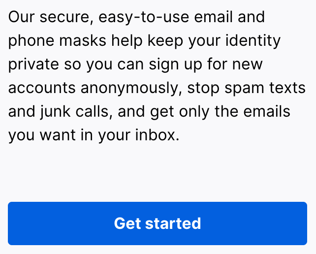
](./docs/img/landing-button-cta.png)

The Google Analytics event:

- The user sees the "Get started" button on the landing page
  - `eventCategory`: `Sign In`
  - `eventAction`: `View`
  - `eventLabel`: `home-hero-cta`
  - `nonInteraction`: true

#### <a name="ctx-landing-banner-bundle">Premium Bundle Banner</a>

A banner on the landing page promotes the Relay Premium and Mozilla VPN bundle. It
appears if the bundle is available for the visitor's region.

The banner:

The Google Analytics events:

- The visitor clicks the "Get Mozilla VPN + Relay" button on the Premium Bundle Banner.
  - `eventCategory`: `Purchase Bundle button`
  - `eventAction`: `Engage`
  - `eventLabel`: `bundle-banner-upgrade-promo`
- The visitor sees the "Get Mozilla VPN + Relay" button on the Premium Bundle Banner.
  - `eventCategory`: `Bundle banner`
  - `eventAction`: `View`
  - `eventLabel`: `bundle-banner-upgrade-promo`:w
  - `nonInteraction`: true

#### <a name="ctx-landing-banner-holiday">Holiday Sale Banner</a>

At the end of 2023, Relay had a sale on yearly subscriptions, promoted by a banner. This
banner no longer appears after December 31, 2023. It was paired with a
[News item](#ctx-navbar-news) for logged-in users.

The banner:

Google Analytics events:

- The visitor sees the holiday promotion banner
  - `eventCategory`: `Holiday Promotion Banner 2023`
  - `eventAction`: `View`
  - `eventLabel`: `holiday-promo-banner-view`
  - `nonInteraction`: true
- The visitor clicks the "Get 1 year of Premium" button in the holiday promotion banner
  - `eventCategory`: `Holiday Promotion Banner 2023`
  - `eventAction`: `Engage`
  - `eventLabel`: `holiday-promo-banner-get-one-year-btn`

#### <a name="ctx-landing-matrix">Plan Matrix</a>

The Plan Matrix shows the differences between the different plans for Firefox Relay, and
prompts the visitor to sign up for the service. If a plan is not available in the visitor's
region, then the plan is not shown.

The Plan Matrix at desktop widths, for US visitors:

At mobile widths, the information is split to cards, such as the premium card:

[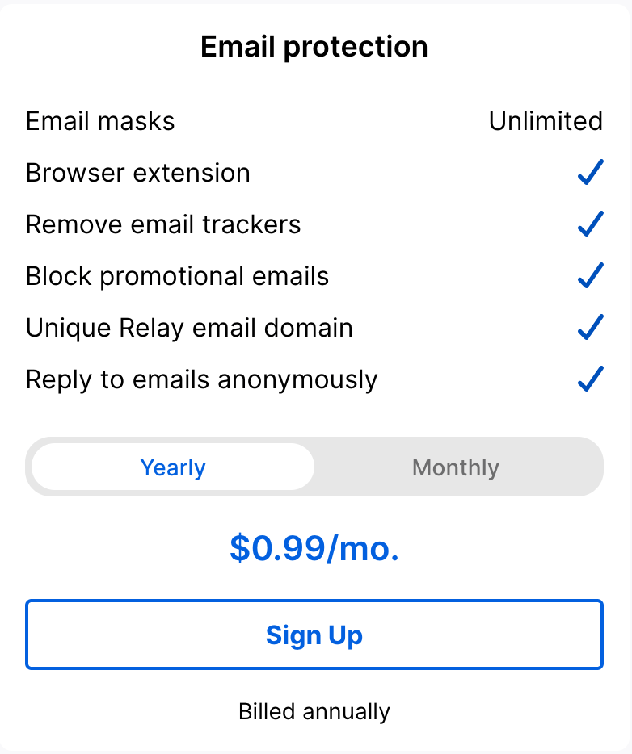](./docs/img/landing-matrix-premium-mobile.png)

The Google Analytics events:

- The visitor sees the "Get Relay" button for the Free plan on the desktop-sized matrix.
  - `eventCategory`: `Sign In`
  - `eventAction`: `View`
  - `eventLabel`: `plan-matrix-free-cta-desktop`
  - `nonInteraction`: true
- The visitor clicks the "Get Relay" button for the Free plan on the desktop-sized matrix.
  - `eventCategory`: `Sign In`
  - `eventAction`: `Engage`
  - `eventLabel`: `plan-matrix-free-cta-desktop`
- The visitor sees the "Get Relay" button for the Free plan on the mobile-sized card.
  - `eventCategory`: `Sign In`
  - `eventAction`: `View`
  - `eventLabel`: `plan-matrix-free-cta-mobile`
- The visitor clicks the "Get Relay" button for the Free plan on the mobile-sized card.
  - `eventCategory`: `Sign In`
  - `eventAction`: `Engage`
  - `eventLabel`: `plan-matrix-free-cta-mobile`
- The visitor sees the "Sign Up" button for the monthly Email protection (premium) plan
  on the desktop-sized matrix.
  - `eventCategory`: `Purchase monthly Premium button`
  - `eventAction`: `View`
  - `eventLabel`: `plan-matrix-premium-monthly-cta-desktop`
- The visitor clicks the "Sign Up" button for the monthly Email protection (premium) plan
  on the desktop-sized matrix.
  - `eventCategory`: `Purchase monthly Premium button`
  - `eventAction`: `Engage`
  - `eventLabel`: `plan-matrix-premium-monthly-cta-desktop`
- The visitor sees the "Sign Up" button for the monthly Email protection (premium) plan
  on the mobile-sized card.
  - `eventCategory`: `Purchase monthly Premium button`
  - `eventAction`: `View`
  - `eventLabel`: `plan-matrix-premium-monthly-cta-mobile`
- The visitor clicks the "Sign Up" button for the monthly Email protection (premium) plan
  on the mobile-sized card.
  - `eventCategory`: `Purchase monthly Premium button`
  - `eventAction`: `Engage`
  - `eventLabel`: `plan-matrix-premium-monthly-cta-mobile`
- The user returns to the Relay site after purchasing the monthly premium plan.
  - `eventCategory`: `Purchase monthly Premium button`
  - `eventAction`: `Completed purchase`
  - `eventLabel`: `user_purchased_premium`
- The visitor sees the "Sign Up" button for the yearly Email protection (premium) plan
  on the desktop-sized matrix.
  - `eventCategory`: `Purchase yearly Premium button`
  - `eventAction`: `View`
  - `eventLabel`: `plan-matrix-premium-yearly-cta-desktop`
- The visitor clicks the "Sign Up" button for the yearly Email protection (premium) plan
  on the desktop-sized matrix.
  - `eventCategory`: `Purchase yearly Premium button`
  - `eventAction`: `Engage`
  - `eventLabel`: `plan-matrix-premium-yearly-cta-desktop`
- The visitor sees the "Sign Up" button for the yearly Email protection (premium) plan
  on the mobile-sized card.
  - `eventCategory`: `Purchase yearly Premium button`
  - `eventAction`: `View`
  - `eventLabel`: `plan-matrix-premium-yearly-cta-mobile`
- The visitor clicks the "Sign Up" button for the yearly Email protection (premium) plan
  on the mobile-sized card.
  - `eventCategory`: `Purchase yearly Premium button`
  - `eventAction`: `Engage`
  - `eventLabel`: `plan-matrix-premium-yearly-cta-mobile`
- The user returns to the Relay site after purchasing the yearly premium plan.
  - `eventCategory`: `Purchase yearly Premium button`
  - `eventAction`: `Completed purchase`
  - `eventLabel`: `user_purchased_premium`
- The visitor sees the "Sign Up" button for the monthly Email & phone protection (phones) plan
  on the desktop-sized matrix.
  - `eventCategory`: `Purchase monthly Premium+phones button`
  - `eventAction`: `View`
  - `eventLabel`: `plan-matrix-phone-monthly-cta-desktop`
- The visitor clicks the "Sign Up" button for the monthly Email & phone protection (phones) plan
  on the desktop-sized matrix.
  - `eventCategory`: `Purchase monthly Premium+phones button`
  - `eventAction`: `Engage`
  - `eventLabel`: `plan-matrix-phone-monthly-cta-desktop`
- The visitor sees the "Sign Up" button for the monthly Email & phone protection (phones) plan
  on the mobile-sized card.
  - `eventCategory`: `Purchase monthly Premium+phones button`
  - `eventAction`: `View`
  - `eventLabel`: `plan-matrix-phone-monthly-cta-mobile`
- The visitor clicks the "Sign Up" button for the monthly Email & phone protection (phone) plan
  on the mobile-sized card.
  - `eventCategory`: `Purchase monthly Premium+phones button`
  - `eventAction`: `Engage`
  - `eventLabel`: `plan-matrix-phone-monthly-cta-mobile`
- The user returns to the Relay site after purchasing the monthly phone plan.
  - `eventCategory`: `Purchase monthly Premium+phones button`
  - `eventAction`: `Completed purchase`
  - `eventLabel`: `user_purchased_premium`
- The visitor sees the "Sign Up" button for the yearly Email & phone protection (phone) plan
  on the desktop-sized matrix.
  - `eventCategory`: `Purchase yearly Premium+phones button`
  - `eventAction`: `View`
  - `eventLabel`: `plan-matrix-phone-yearly-cta-desktop`
- The visitor clicks the "Sign Up" button for the yearly Email & phone protection (phone) plan
  on the desktop-sized matrix.
  - `eventCategory`: `Purchase yearly Premium+phones button`
  - `eventAction`: `Engage`
  - `eventLabel`: `plan-matrix-phone-yearly-cta-desktop`
- The visitor sees the "Sign Up" button for the yearly Email & phone protection (phone) plan
  on the mobile-sized card.
  - `eventCategory`: `Purchase yearly Premium+phones button`
  - `eventAction`: `View`
  - `eventLabel`: `plan-matrix-phone-yearly-cta-mobile`
- The visitor clicks the "Sign Up" button for the yearly Email & phone protection (phone) plan
  on the mobile-sized card.
  - `eventCategory`: `Purchase yearly Premium+phones button`
  - `eventAction`: `Engage`
  - `eventLabel`: `plan-matrix-phone-yearly-cta-mobile`
- The user returns to the Relay site after purchasing the yearly phone plan.
  - `eventCategory`: `Purchase yearly Premium+phones button`
  - `eventAction`: `Completed purchase`
  - `eventLabel`: `user_purchased_premium`
- The visitor sees the "Sign Up" button for the yearly Add VPN protection (bundle) plan
  on the desktop-size matrix.
  - `eventCategory`: `Purchase Bundle button`
  - `eventAction`: `View`
  - `eventLabel`: `plan-matrix-bundle-cta-desktop`
- The visitor clicks the "Sign Up" button for the yearly Add VPN protection (bundle) plan
  on the desktop-size matrix.
  - `eventCategory`: `Purchase Bundle button`
  - `eventAction`: `Engage`
  - `eventLabel`: `plan-matrix-bundle-cta-desktop`
- The visitor sees the "Sign Up" button for the yearly Add VPN protection (bundle) plan
  on the mobile-size matrix.
  - `eventCategory`: `Purchase Bundle button`
  - `eventAction`: `View`
  - `eventLabel`: `plan-matrix-bundle-cta-mobile`
- The visitor clicks the "Sign Up" button for the yearly Add VPN protection (bundle) plan
  on the mobile-sized card.
  - `eventCategory`: `Purchase Bundle button`
  - `eventAction`: `Engage`
  - `eventLabel`: `plan-matrix-bundle-cta-mobile`
- The user returns to the Relay site after purchasing the yearly bundle plan.
  - `eventCategory`: `Purchase Bundle button`
  - `eventAction`: `Completed purchase`
  - `eventLabel`: `user_purchased_premium`

### <a name="ctx-navbar">Navigation Bar</a>

The navigation bar is at the top of all pages, and changes based on the screen size and context.

At **desktop screen widths**, it looks like this:

On the landing page, for anonymous visitors:

On the email masks dashboard, for free users:

[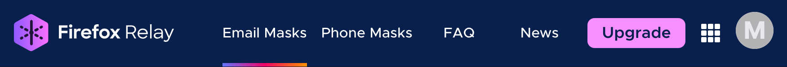](./docs/img/navbar-dashboard-free-desktop.png)

At **mobile screen widths**, it looks like this:

On the landing page, for anonymous visitors:

On the email masks dashboard, for free users:

#### <a name="ctx-navbar-sign-up">Sign Up button</a>

The "Sign Up" button is shown on desktop-width screens for anonymous visitors.

The Google Analytics events:

- The visitor sees the "Sign Up" button in the navigation bar.
  - `eventCategory`: `Sign In`
  - `eventAction`: `View`
  - `eventLabel`: `nav-profile-sign-up`
  - `nonInteraction`: true
- The visitor clicks the "Sign Up" button in the navigation bar.
  - `eventCategory`: `Sign In`
  - `eventAction`: `Engage`
  - `eventLabel`: `nav-profile-sign-up`

#### <a name="ctx-navbar-sign-in">Sign In button</a>

The "Sign In" button, with a border, is shown for anonymous visitors on all screen sizes.

The Google Analytics events:

- The visitor views the "Sign In" button in the navigation bar.
  - `eventCategory`: `Sign In`
  - `eventAction`: `View`
  - `eventLabel`: `nav-profile-sign-in`
  - `nonInteraction`: true
- The visitor clicks the "Sign In" button in the navigation bar.
  - `eventCategory`: `Sign In`
  - `eventAction`: `Engage`
  - `eventLabel`: `nav-profile-sign-in`

#### <a name="ctx-navbar-news">News Menu</a>

The News menu appears for logged-in users. The news items highlight new features,
subscriptions, and promotions. It appears as a drop-down menu that covers the rest of
the content.

At the end of 2023, Relay offered a discount for yearly Relay subscriptions. This was
paired with a [Holiday Sale Banner](#ctx-landing-banner-holiday) on the landing page.
This no longer appears after December 31, 2023. This news item emits the Google Analytics
events for other news items, as well as some additional events.

The news menu, with no current news items:

The news menu, History tab:

[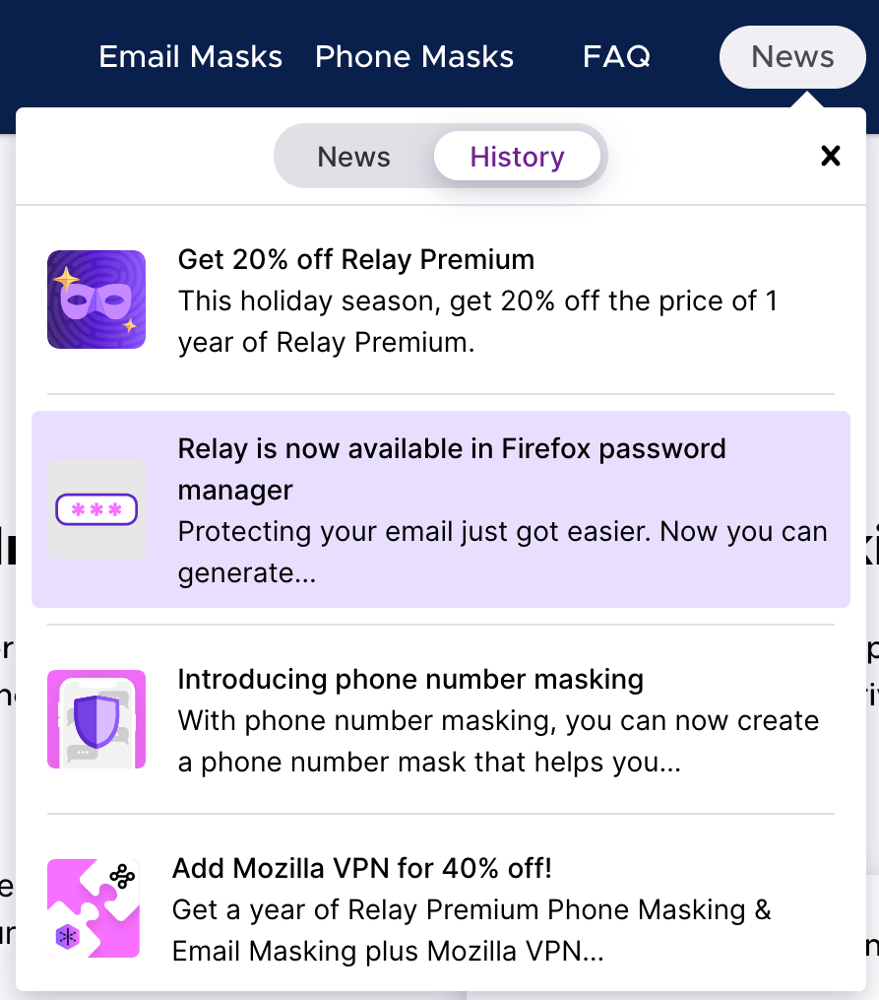](./docs/img/news-history.png)

The news menu, with a news entry expanded:

[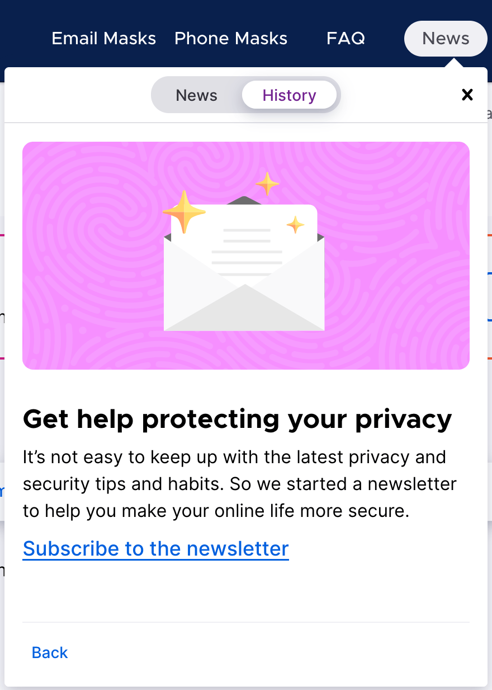](./docs/img/news-entry.png)

The news menu, with the holiday promotion news item expanded:

Google Analytics events:

- The user clicks on "News" in the navigation bar to open the news menu
  - `eventCategory`: `News`
  - `eventAction`: `Open`
  - `eventLabel`: `header-nav`
- The user clicks on "News" to close the news menu
  - `eventCategory`: `News`
  - `eventAction`: `Close`
  - `eventLabel`: `header-nav`
- The user clicks the News tab in the news menu
  - `eventCategory`: `News`
  - `eventAction`: `Switch to 'News' tab`
  - `eventLabel`: `News`
- The user clicks the History tab in the news menu
  - `eventCategory`: `News`
  - `eventAction`: `Switch to 'History' tab`
  - `eventLabel`: `History`
- The user clicks the "Clear all" button in the news tab to clear all news
  - `eventCategory`: `News`
  - `eventAction`: `Clear all`
  - `eventLabel`: `news-dashboard`
  - `eventValue`: _number of news entries cleared_
- The user sees a news entry summary
  - `eventCategory`: `News`
  - `eventAction`: `View`
  - `eventLabel`: _The Entry Title_
  - `nonInteraction`: true
- The user clicks a news entry summary to view the full entry
  - `eventCategory`: `News`
  - `eventAction`: `Open entry`
  - `eventLabel`: _The Entry Title_
- The user clicks the "Back" button in a full news entry
  - `eventCategory`: `News`
  - `eventAction`: `Close entry`
  - `eventLabel`: _The Entry Title_
- The user views the expanded Holiday promotion news item
  - `eventCategory`: `Holiday Promo News CTA`
  - `eventAction`: `View`
  - `eventLabel`: `holiday-promo-2023-news-cta`
  - `nonInteraction`: true
- The user clicks "Get 1 year of Relay Premium" link in the Holiday promotion news item
  entry.
  - `eventCategory`: `Holiday Promo News CTA`
  - `eventAction`: `Engage`
  - `eventLabel`: `holiday-promo-2023-news-cta`

#### <a name="ctx-navbar-upgrade">Upgrade Button</a>

The "Upgrade" button appears for users on the free plan. It is styled like a link in
mobile widths. It takes users to the [Premium Page][].

The Google Analytics events:

- The user sees the "Upgrade" button in the navigation bar (mobile?)
  - `eventCategory`: `Purchase Button`
  - `eventAction`: `View`
  - `eventLabel`: `navbar-upgrade-button`
  - `nonInteraction`: true
- The user clicks the "Upgrade" button in the navigation bar
  - `eventCategory`: `Purchase Button`
  - `eventAction`: `Engage`
  - `eventLabel`: `navbar-upgrade-button`

#### <a name="ctx-navbar-bento">Firefox Apps Menu</a>

The button that looks like a grid of squares opens a menu of other Mozilla products.
Internally, we call this a "Bento Box", to refer to the Japanese [bento][] meal box.

[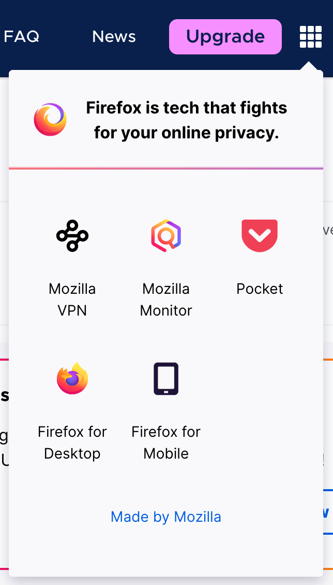](./docs/img/navbar-dashboard-free-desktop-bento-open.png)

The Google Analytics events:

- The user clicks on the bento button in the navigation bar to open the bento menu.
  - `eventCategory`: `bento`
  - `eventAction`: `bento-opened`
  - `eventLabel`: _empty_
- The user clicks on the bento button in the navigation bar to close the bento menu.
  - `eventCategory`: `bento`
  - `eventAction`: `bento-closed`
  - `eventLabel`: _empty_
- The user clicks an application image or link in the bento menu.
  - `eventCategory`: `bento`
  - `eventAction`: `bento-app-link-click`
  - `eventLabel`: One of:
    - `vpn` (Mozilla VPN)
    - `moz-monitor` (Mozilla Monitor)
    - `pocket` (Pocket)
    - `fx-desktop` (Firefox for Desktop)
    - `fx-mobile` (Firefox for Mobile)
- The user clicks the "Made by Mozilla" link in the bento menu.
  - `eventCategory`: `bento`
  - `eventAction`: `bento-app-link-click`
  - `eventLabel`: `Mozilla`

[bento]: https://en.wikipedia.org/wiki/Bento

#### <a name="ctx-navbar-user">User Menu</a>

When the user is logged in, the left-most navigation bar button contains the user menu.
On desktop-sized screens, the button is the user's Mozilla account profile picture. This
defaults to a circular image of the first letter of their email address. In mobile-sized
screens, the button is a [hamburger menu button][] (similar to ☰) and includes links to
other Relay pages. In both cases, this menu has the "Sign Out" link for users.

[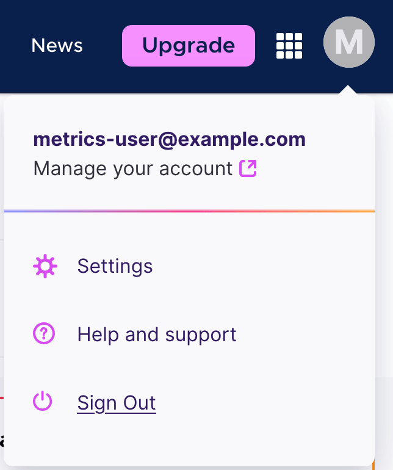](./docs/img/navbar-user-menu-desktop.png)

The Google Analytics event:

- The user clicks the "Sign Out" link in the user menu dropdown
- `eventCategory`: Sign Out
  - `eventAction`: Click
  - `eventLabel`: Website Sign Out

[hamburger menu button]: https://en.wikipedia.org/wiki/Hamburger_button

### Onboarding

Onboarding is the process for introducing a user to Relay and getting their account
setup. The user should have a sense of where they are in the process, how much remains,
and be able to skip the process.

#### <a name="ctx-onboarding-free">Free Onboarding</a>

When a user signs up for the free Relay account, they go through the Free Onboarding
process. They see where they are in the process through a progress indicator at the
bottom of the screen.

On step 1, we explain email masks and prompt the user to generate their first mask:

[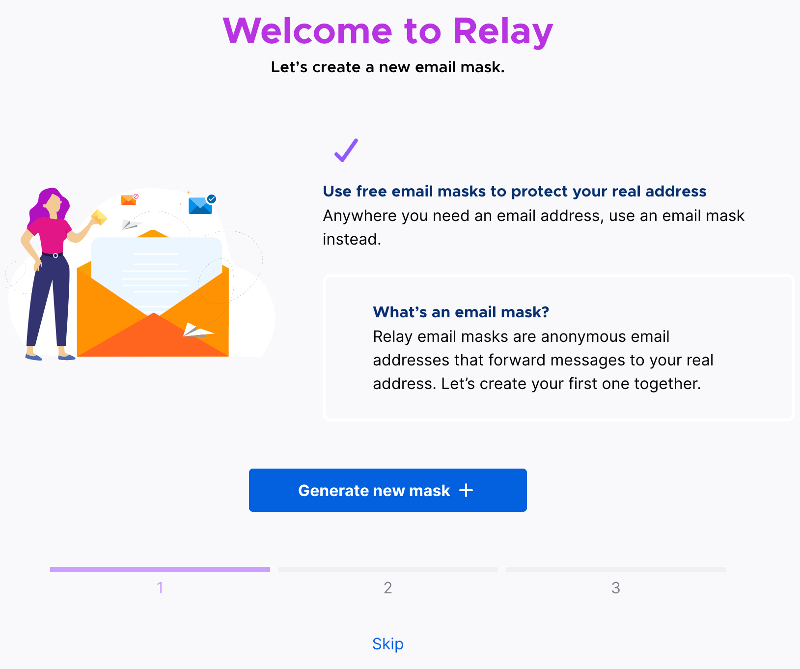](./docs/img/onboarding-free-step1.png)

On step 2, we show the new mask and show how forwarding works:

[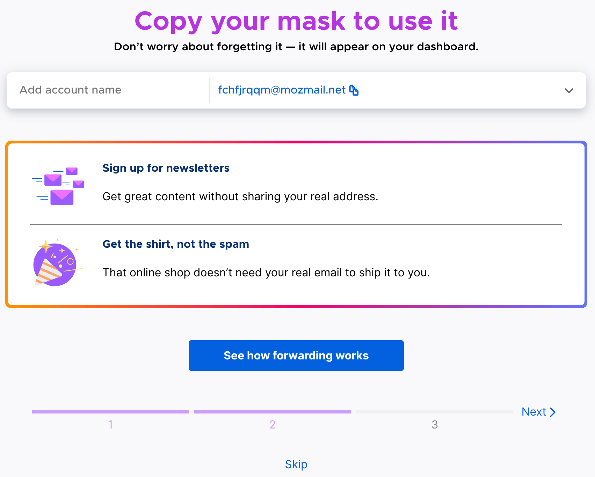](./docs/img/onboarding-free-step2a.png)

We ask the user to paste their first email mask address and send a test email:

[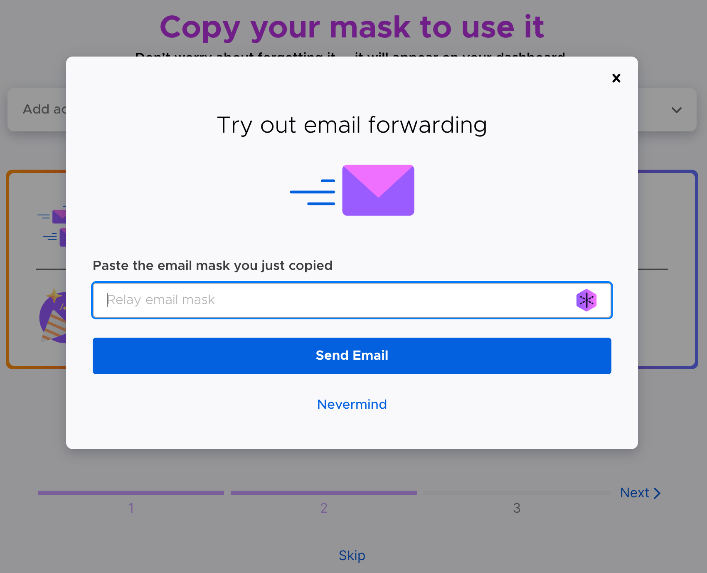](./docs/img/onboarding-free-step2b.png)

We send an email and ask the user to check their inbox:
[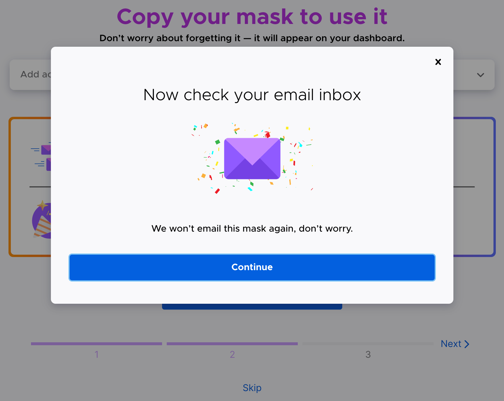](./docs/img/onboarding-free-step2c.png)

On step 3, we introduce the Relay extension and prompt the user to install it:

[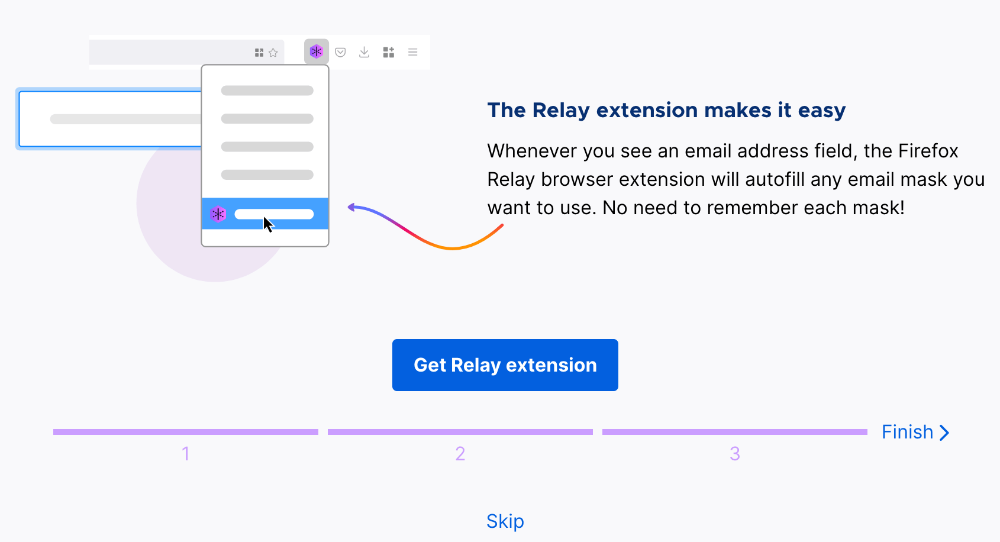](./docs/img/onboarding-free-step3.png)

The Google Analytics events:

- The user can see the "Skip" link on the first step of free onboarding
  - `eventCategory`: `Free Onboarding`
  - `eventAction`: `View`
  - `eventLabel`: `free-onboarding-step-1-skip`
  - `nonInteraction`: true
- The user clicks the "Skip" link on the first step of free onboarding
  - `eventCategory`: `Free Onboarding`
  - `eventAction`: `Engage`
  - `eventLabel`: `onboarding-step-1-skip`
  - `eventValue`: 1
- The user clicks the "Generate new mask" button on the first step of free onboarding
  - `eventCategory`: `Free Onboarding`
  - `eventAction`: `Engage`
  - `eventLabel`: `onboarding-step-1-create-random-mask`
  - `eventValue`: 1
- The user sees the "Skip" link on the second step of free onboarding.
  - `eventCategory`: `Free Onboarding`
  - `eventAction`: `View`
  - `eventLabel`: `free-onboarding-step-2-skip`
  - `nonInteraction`: true
- The user clicks the "Skip" link on the second step of free onboarding.
  - `eventCategory`: `Free Onboarding`
  - `eventAction`: `Engage`
  - `eventLabel`: `onboarding-step-2-skip`
  - `eventValue`: 1
- The user sees the "Next >" link on the second step of free onboarding.
  - `eventCategory`: `Free Onboarding`
  - `eventAction`: `View`
  - `eventLabel`: `free-onboarding-step-2-next`
  - `nonInteraction`: true
- The user clicks the "Next >" link on the second step of free onboarding.
  - `eventCategory`: `Free Onboarding`
  - `eventAction`: `Engage`
  - `eventLabel`: `onboarding-step-2-next`
  - `eventValue`: 1
- The user clicks the "Send Email" button in the forwarding test modal on the second step of free
  onboarding.
  - `eventCategory`: `Free Onboarding`
  - `eventAction`: `Engage`
  - `eventLabel`: `onboarding-step-2-forwarding-test`
  - `eventValue`: 1
- The user clicks the "Continue" button in the forwarding test modal, after sending a
  test email, in the second step of free onboarding.
  - `eventCategory`: `Free Onboarding`
  - `eventAction`: `Engage`
  - `eventLabel`: `onboarding-step-2-continue`
  - `eventValue`: 1
- The user sees the "Skip" link in the third step of free onboarding
  - `eventCategory`: `Free Onboarding`
  - `eventAction`: `View`
  - `eventLabel`: `free-onboarding-step-2-skip`
  - `nonInteraction`: true
- The user clicks the "Skip" link on the third step of free onboarding
  - `eventCategory`: `Free Onboarding`
  - `eventAction`: `Engage`
  - `eventLabel`: `onboarding-step-3-skip`
  - `eventValue`: 1
- The user clicks the "Finish >" link on third step of free onboarding
  - `eventCategory`: `Free Onboarding`
  - `eventAction`: `Engage`
  - `eventLabel`: `onboarding-step-3-complete`
  - `eventValue`: 1

#### <a name="ctx-onboarding-premium">Premium Onboarding</a>

When a user signs up for or upgrades to the Relay Premium service, they go through the
Premium Onboarding process. They see where they are in the process through a progress
indicator at the bottom of the screen.

On step 1, we list the benefits of Relay Premium:

[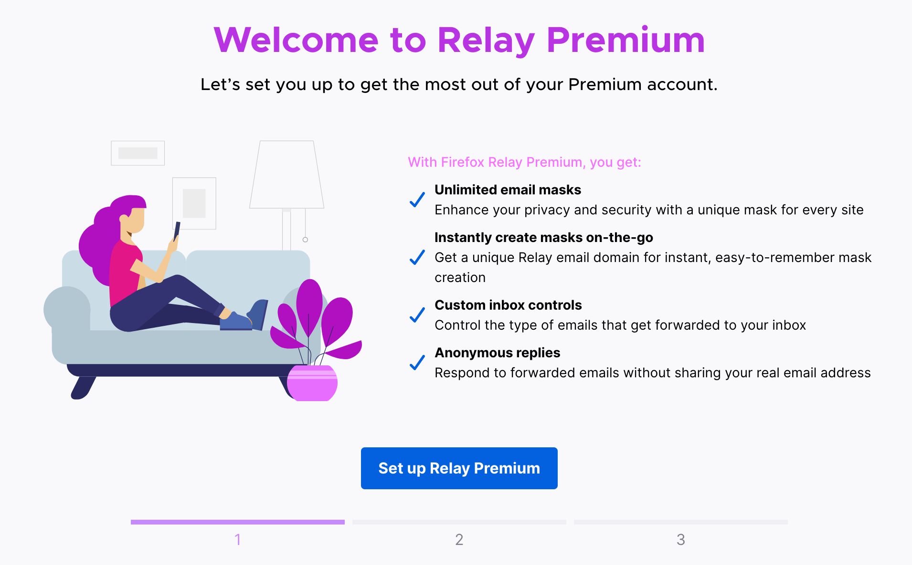](./docs/img/onboarding-premium-step1.png)

On step 2, we prompt the user to setup a custom subdomain:

[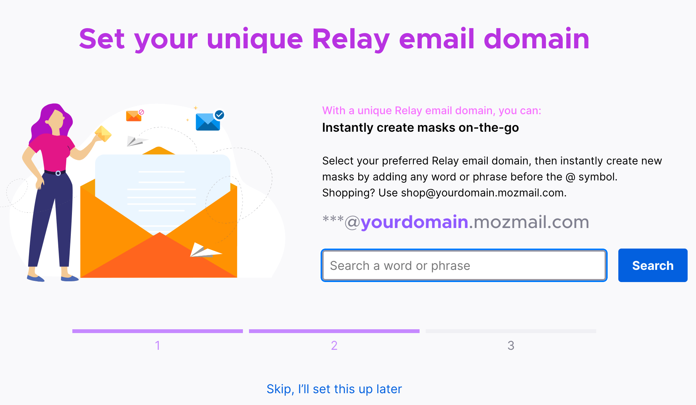](./docs/img/onboarding-premium-step2a.png)

If the subdomain is available, the user can register it.

We then confirm the user has reserved their custom subdomain.

On step 3, we introduce the Relay extension and prompt the user to install it:

[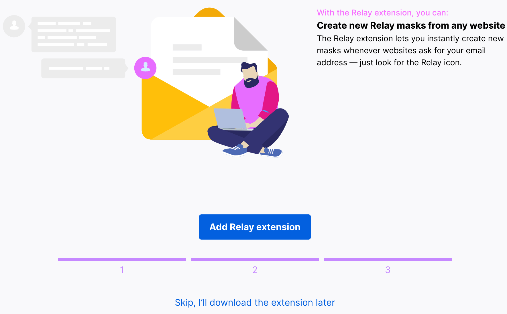](./docs/img/onboarding-premium-step3a.png)

When the extension is installed, the user can exit onboarding and go to the dashboard.

The Google Analytics events:

- The user sees the "Set up Relay Premium" button on the first step of premium onboarding.
  - `eventCategory`: `Premium Onboarding`
  - `eventAction`: `View`
  - `eventLabel`: `onboarding-step-1-continue`
  - `eventValue`: 1
  - `nonInteraction`: true
- The user clicks the "Set up Relay Premium" button on the first step of premium onboarding.
  - `eventCategory`: `Premium Onboarding`
  - `eventAction`: `Engage`
  - `eventLabel`: `onboarding-step-1-continue`
- The user sees the link "Skip, I'll set this up later" on the second step of premium
  onboarding.
  - `eventCategory`: `Premium Onboarding`
  - `eventAction`: `View`
  - `eventLabel`: `onboarding-step-2-skip`
  - `eventValue`: 2
  - `nonInteraction`: true
- The user clicks the "Skip, I'll set this up later" link on the second step of premium
  onboarding.
  - `eventCategory`: `Premium Onboarding`
  - `eventAction`: `Engage`
  - `eventLabel`: `onboarding-step-2-skip`
- The user sees the "Continue" button after selecting a custom domain on the second step of
  premium onboarding.
  - `eventCategory`: `Premium Onboarding`
  - `eventAction`: `View`
  - `eventLabel`: `onboarding-step-2-continue`
  - `eventValue`: 2
- The user clicks the "Continue" button on the second step of premium onboarding.
  - `eventCategory`: `Premium Onboarding`
  - `eventAction`: `Engage`
  - `eventLabel`: `onboarding-step-2-continue`
- The user sees the "Skip, I’ll download the extension later" link on the third step of
  premium onboarding.
  - `eventCategory`: `Premium Onboarding`
  - `eventAction`: `View`
  - `eventLabel`: `onboarding-step-3-skip`
  - `eventValue`: 3
- The user clicks the "Skip, I’ll download the extension later" ling on the third step of
  premium onboarding.
  - `eventCategory`: `Premium Onboarding`
  - `eventAction`: `Engage`
  - `eventLabel`: `onboarding-step-3-skip`
- The user see the "Go to Dashboard" button after installing the extension on the third step of
  premium onboarding.
  - `eventCategory`: `Premium Onboarding`
  - `eventAction`: `View`
  - `eventLabel`: `onboarding-step-3-continue`
  - `eventValue`: 3
  - `nonInteraction`: true
- The user clicks the "Go to Dashboard" button after installing the extension on third step of
  premium onboarding.
  - `eventCategory`: `Premium Onboarding`
  - `eventAction`: `Engage`
  - `eventLabel`: `onboarding-step-3-continue`

### Email Masks Dashboard

The Email Masks Dashboard is the default page for logged-in users. It is internally
called the profile page.

#### <a name="ctx-emails-banner-maximize">Maximize your email and phone protection banner</a>

A user on the free plan at their mask limit will see a large banner at the top of the
email masks dashboard. The title is "Maximize your email and phone protection". The
button is labeled "Upgrade to Premium" and takes the user to the [Premium Page, Plan Matrix][].

The Google Analytics events:

- The user sees the "Maximize your email and phone protection" banner and "Upgrade to Premium" button.
  - `eventCategory`: `Purchase Button`
  - `eventAction`: `View`
  - `eventLabel`: `upgrade-premium-header-mask-limit`
  - `nonInteraction`: true
- The user clicks the "Upgrade to Premium" button on the "Maximize your email and phone protection" banner.
  - `eventCategory`: `Purchase Button`
  - `eventAction`: `Engage`
  - `eventLabel`: `upgrade-premium-header-mask-limit`

#### <a name="ctx-emails-link-get-domain">Get Domain Link</a>

A user on the free plan will be prompted to get their own email domain by upgrading to a
premium plan. This link appears under their real email address.

The Google Analytics events:

- The user sees the "Get your own email domain with Premium" link.
  - `eventCategory`: `Purchase Button`
  - `eventAction`: `View`
  - `eventLabel`: `profile-set-custom-domain`
  - `nonInteraction`: true
- The user clicks the "Get your own email domain with Premium" link
  - `eventCategory`: `Purchase Button`
  - `eventAction`: `Engage`
  - `eventLabel`: `profile-set-custom-domain`

#### <a name="ctx-emails-banner-bundle">Relay + VPN Banner</a>

A user in an eligible region without VPN will be prompted to sign up for the Relay and
VPN bundle. The link goes to the [Plan Matrix on the Premium Page](#ctx-premium-matrix).

The Google Analytics events:

- The user sees the " button in the "Introducing: Relay + VPN subscription plan" banner
  on the email masks page.
  - `eventCategory`: `Purchase Bundle button`
  - `eventAction`: `View`
  - `eventLabel`: `profile-banner-bundle-promo`
  - `nonInteraction`: true
- The user clicks the "Upgrade now" button in the "Introducing: Relay + VPN subscription
  plan" banner.
  - `eventCategory`: `Purchase Bundle button`
  - `eventAction`: `Engage`
  - `eventLabel`: `profile-banner-bundle-promo`

#### <a name="ctx-emails-banner-firefox">Get Firefox Banner</a>

A user on a non-Firefox browser will be prompted to download Firefox:

[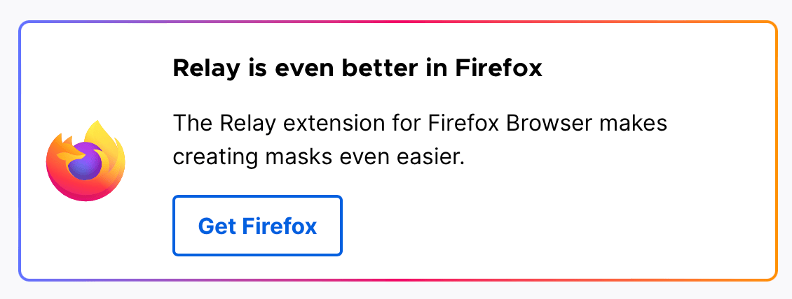](./docs/img/emails-banner-firefox.png)

- The user clicks "Get Firefox" in "Relay even better in Firefox" banner
  - `eventCategory`: `Download Firefox`
  - `eventAction`: `Engage`
  - `eventLabel`: `profile-banner-download-firefox`

#### <a name="ctx-emails-banner-extension">Download Extension Banners</a>

A Firefox user that does not have the [Firefox Relay Extension][] will be prompted to
install it:

A Chrome user that does not have the [Chrome Relay Extension][] will be prompted to
install it:

Google Analytics events:

- The user clicks "Add Relay to Firefox" in the "Get the Relay extension for Firefox" banner.
  - `eventCategory`: `Download Firefox`
  - `eventAction`: `Engage`
  - `eventLabel`: `profile-banner-download-firefox-extension`
- The user clicks "Get the Relay extension" in the "Try Relay for Google Chrome" banner.
  - `eventCategory`: `Download Firefox`
  - `eventAction`: `Engage`
  - `eventLabel`: `profile-banner-download-chrome-extension`

[Chrome Relay Extension]: https://chromewebstore.google.com/detail/firefox-relay/lknpoadjjkjcmjhbjpcljdednccbldeb "The Firefox Relay extension on the Chrome Web Store"
[Firefox Relay Extension]: https://addons.mozilla.org/en-US/firefox/addon/private-relay/ "The Firefox Relay extension on Firefox Browser Add-Ons"

#### <a name="ctx-emails-button-unlimited">Unlimited Button</a>

When a user is allowed to create a new email mask, the button is labelled "+ Generate
new mask", and creates a new mask:. When a free user has 5 email masks, the button
label changes to "Get unlimited email masks", and takes the user to the
[Premium Page][].

The button when a user can create a new mask:

The button when a free user has 5 email masks:

The Google Analytics events:

- The user sees the "Get unlimited email masks" button
  - `eventCategory`: `Purchase Button`
  - `eventAction`: `View`
  - `eventLabel`: `profile-create-alias-upgrade-promo`
  - `nonInteraction`: true
- The user clicks "Get unlimited email masks" button
  - `eventCategory`: `Purchase Button`
  - `eventAction`: `Engage`
  - `eventLabel`: `profile-create-alias-upgrade-promo`

#### <a name="ctx-emails-detail">Email Mask Details</a>

Clicking the downward arrowhead on the right side of an email mask opens the details for
that mask.

The Google Analytics events:

- The user changes the blocking settings ("What emails do you want to block?") for a mask.
  - `eventCategory`: `Dashboard Alias Settings`
  - `eventAction`: `Toggle Forwarding`
  - `eventLabel`: One of:
    - `User disabled forwarding` (None)
    - `User enabled promotional emails blocking` (Promotions, disabled for free users)
    - `User enabled forwarding` (All)

#### <a name="ctx-emails-corner-upgrade">Upgrade Corner Notification</a>

When a user on the free plan has 4 email masks, a notification appears in the lower
right corner that prompts the user to upgrade to the premium plan.

[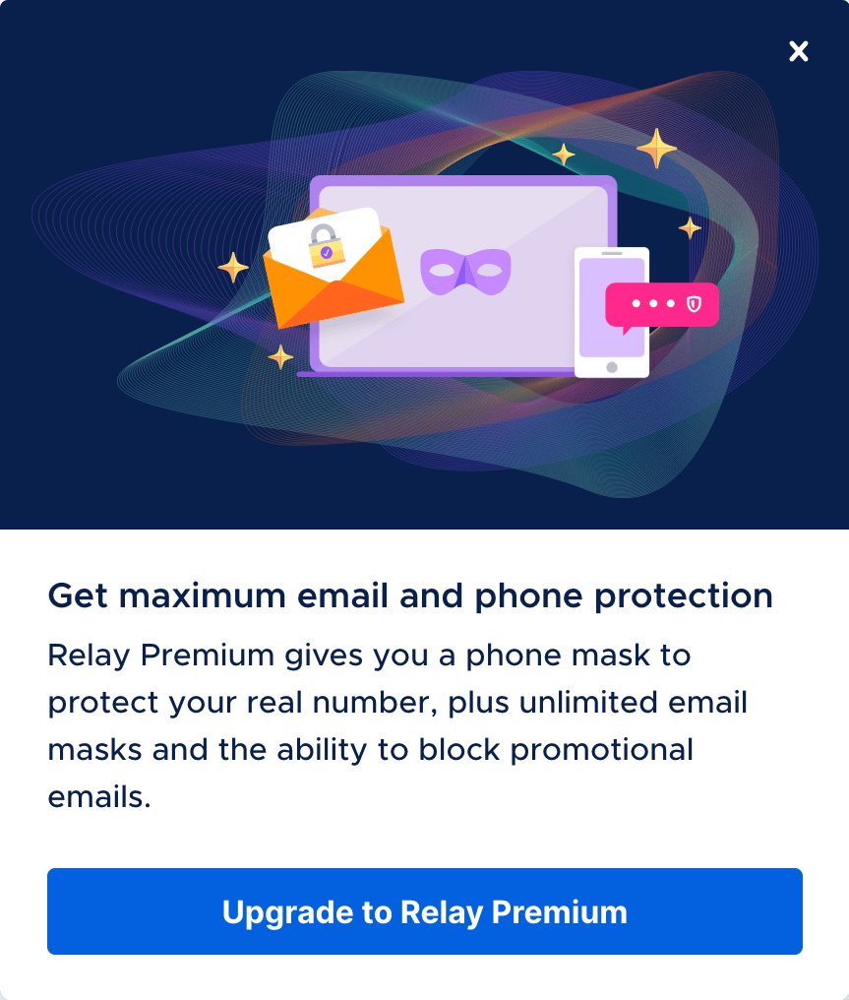](./docs/img/emails-corner-upgrade.png)

The Google Analytics events:

- The user sees the upgrade corner notification.
  - `eventCategory`: `Purchase Button`
  - `eventAction`: `View`
  - `eventLabel`: `4-mask-limit-upsell`
  - `nonInteraction`: true
- The user clicks the "Upgrade to Relay Premium" button in the upgrade corner
  notification.
  - `eventCategory`: `Purchase Button`
  - `eventAction`: `Engage`
  - `eventLabel`: `4-mask-limit-upsell`

### Phone Masks Dashboard

For users in an eligible region without the phone mask plan, the [Phone Masks
dashboard][] promotes the features and benefits. For users with a new phone
subscription, it provides Phone Onboarding, then management of the phone mask.

[Phone Masks dashboard]: https://relay.firefox.com/phone/

#### <a name="ctx-phones-button-upgrade">Introducing phone number masking</a>

When a user in an eligible region does not have the phone mask plan, the page shows an
introduction to phone masking, including the plan pricing details. The default shows the
monthly price when paid yearly, and the user can switch to the per-month price. The user
can start the subscription process by clicking the 'Upgrade Now' button.

The Google Analytics events:

- The user without a phone plan sees the 'Upgrade to get phone number masking' box with
  monthly pricing on the phone masks dashboard.
  - `eventCategory`: `Purchase monthly Premium+phones button`
  - `eventAction`: `View`
  - `eventLabel`: `phone-onboarding-purchase-monthly-cta`
  - `nonInteraction`: true
- The user clicks 'Upgrade Now' with monthly pricing on the phone masks dashboard.
  - `eventCategory`: `Purchase monthly Premium+phones button`
  - `eventAction`: `Engage`
  - `eventLabel`: `phone-onboarding-purchase-monthly-cta`
- The user without a phone plan sees the 'Upgrade to get phone number masking' box with
  yearly pricing (the default) on the phone masks dashboard.
  - `eventCategory`: `Purchase yearly Premium+phones button`
  - `eventAction`: `View`
  - `eventLabel`: `phone-onboarding-purchase-yearly-cta`
  - `nonInteraction`: true
- The user clicks 'Upgrade Now' with yearly pricing on the phone masks dashboard.
  - `eventCategory`: `Purchase yearly Premium+phones button`
  - `eventAction`: `Engage`
  - `eventLabel`: `phone-onboarding-purchase-yearly-cta`

### <a name="ctx-tips">Help &amp; Tips Box</a>

The "Help &amp; Tips" box appears in the lower right corner of the Email Masks Dashboard
and the Phone Masks Dashboard when the conditions for the tip is met. It is first
displayed with some teaser text. When it is opened, a video plays along with further
instructions. When the tip is minimized (the downward arrowhead '⌄'), the box remains
without teaser text.

There is a tip for using the custom subdomain to create email masks outside of the Relay
website. There is a second tip for using shorter codes to reply to messages sent to your
phone mask.

The Help & Tips box with a teaser for a new tip:

[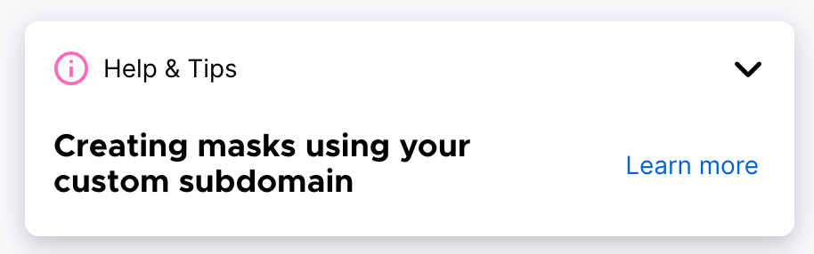](./docs/img/tip-custom-subdomain-teaser.png)

The Help & Tips box showing the tip:

The Help & Tips box with all relevant tips viewed:

The Google Analytics events:

- The user clicks the "Learn more" link to expand a teaser tips box
  - `eventCategory`: `Tips`
  - `eventAction`: `Expand (from teaser)`
  - `eventlabel`: _one of_:
    - `multi-replies` _(phone masks tip)_
    - `custom-subdomain` _(email masks tip)_
- The user sees the expanded tips box
  - `eventCategory`: `Tips`
  - `eventAction`: `View`
  - `eventlabel`: _one of_:
    - `multi-replies` _(phone masks tip)_
    - `custom-subdomain` _(email masks tip)_
  - `nonInteraction`: true
- The user clicks the down arrowhead '⌄' to minimize the tips box
  - `eventCategory`: `Tips`
  - `eventAction`: `Collapse`
  - `eventLabel`: `tips-header`
- The user clicks "Help & Tips" to expand a minimized tips box
  - `eventCategory`: `Tips`
  - `eventAction`: `Expand (from minimised)`
  - `eventlabel`: _one of_:
    - `multi-replies` _(phone masks tip)_
    - `custom-subdomain` _(email masks tip)_

### <a name="ctx-premium">Premium Page</a>

The [Firefox Relay Premium Page][] is similar to the [Landing Page][]. The audience is
users on the free plan, such as those at the 5 mask limit. Users can view the features
and benefits of the paid plans.

[Firefox Relay Premium Page]: https://relay.firefox.com/premium/

#### <a name="ctx-premium-cta">Call To Action</a>

The top "call to action" button, labelled 'Upgrade Now', takes the user to the plan
matrix:

The Google Analytics events:

- The user sees the 'Upgrade Now' button on the Premium page.
  - `eventCategory`: `Purchase Button`
  - `eventAction`: `View`
  - `eventLabel`: `premium-promo-cta`
  - `nonInteraction`: true
- The user clicks the 'Upgrade Now' button
  - `eventCategory`: `Purchase Button`
  - `eventAction`: `Engage`
  - `eventLabel`: `home-hero-cta`

### <a name="ctx-premium-matrix">Plan Matrix</a>

The Plan Matrix on the Premium Page is the same as the
[Plan Matrix on the Landing Page](#ctx-landing-matrix). It has the same Google Analytics
events.

### Surveys

Occasionally we run surveys on the Relay website. These surveys often appear above the
[Navigation Bar][]. We use Google Analytics events to track some aspects of the surveys.

#### <a name="ctx-surveys-csat">Customer Satisfaction (CSAT) Survey</a>

The [Customer Satisfaction][] survey is shown for free users after they have used the
site for 7, 30, and 90 days, and for subscribers after they have been subscribed for 7,
30, and 90 days. It is shown above the navigation bar. When a user picks a satisfaction
level, they are asked to take a two-minute survey on a third-party website. The
information collected in this survey is not covered by this document, but is processed
in accordance with [Mozilla's Privacy Policy][].

[Customer Satisfaction]: https://en.wikipedia.org/wiki/Customer_satisfaction
[Mozilla's Privacy Policy]: https://www.mozilla.org/en-US/privacy/

The Google Analytics events:

- A user clicks their satisfaction level in the CSAT banner.
  - `eventCategory`: `CSAT Survey`
  - `eventAction`: `submitted`
  - `eventLabel`: One of `Very Dissatisfied`, `Dissatisfied`, `Neutral`, `Satisfied`,
    or `Very Satisfied`
  - `eventValue`: `1` (for Very Dissatisfied) to `5` (for Very Satisfied)
  - `dimension3`: One of `Dissatisfied`, `Neutral`, `Satisfied`
  - `dimension4`: One of `Very Dissatisfied`, `Dissatisfied`, `Neutral`, `Satisfied`,
    or `Very Satisfied`
  - `metric10`: `1` (for answer count)
  - `metric11`: `1` (for Very Dissatisfied) to `5` (for Very Satisfied)
  - `metric12`: `-1` (Dissatisfied), `0` (Neutral), or `1` (Satisfied)

#### <a name="ctx-survey-recruitment">Interview Recruitment Survey</a>

The interview recruitment survey for a research study is shown on the Emails dashboard,
when we are actively recruiting for user research. The information collected in this
survey is not covered by this document, but is processed in accordance with
[Mozilla's Privacy Policy][].

The Google Analytics events:

- The user sees the interview recruitment survey.
  - `eventCategory`: `Recruitment`
  - `eventAction`: `View`
  - `eventLabel`: `Want to help improve Firefox Relay? We'd love to hear what you think. Research participants receive a $50 gift card.`
  - `nonInteraction`: true
- The user clicks the link to start the interview recruitment survey.
  - `eventCategory`: `Recruitment`
  - `eventAction`: `Engage`
  - `eventLabel`: `Want to help improve Firefox Relay? We'd love to hear what you think. Research participants receive a $50 gift card.`

#### <a name="ctx-surveys-phone">Phone Masking Survey</a>

Users with the phone service can be prompted to review the service. This survey was
enabled around the launch of the Phone service in 2022. The information collected in
this survey is not covered by this document, but is processed in accordance with
[Mozilla's Privacy Policy][].

The Google Analytics events:

- The user sees the survey
  - `eventCategory`: `Phone launch survey`
  - `eventAction`: `View`
  - `eventLabel`: `Answer 4 questions about phone masking to help improve your experience.`
  - `nonInteraction`: true
- The user clicks the link "Answer 4 questions about phone masking to help improve your experience."
  - `eventCategory`: `Phone launch survey`
  - `eventAction`: `Engage`
  - `eventLabel`: `Answer 4 questions about phone masking to help improve your experience.`

### <a name="ctx-server">Server Events</a>

A Relay user requires a Mozilla account to use the service. This can be an existing
account or a new account created for using Relay. The Relay API server handles the
details of signing up and logging in with a Mozilla account. It sets a cookie,
`server_ga_event`, to communicate if the logged-in user has a newly created Relay
profile, or logged into an existing Profile.

The Google Analytics events:

- The user returns to the Relay website after creating a Relay profile.
  - `eventCategory`: `server event`
  - `eventAction`: `fired`
  - `eventLabel`: `user_signed_up`
- The user returns to the Relay website after logging into an existing Relay profile.
  - `eventCategory`: `server event`
  - `eventAction`: `fired`
  - `eventLabel`: `user_logged_in`

### Legacy Website Tracking

There are components in the Relay Website code base that are not currently used on the
site. They are documented here for completeness.

#### <a name="ctx-legacy-purchase-premium">Purchased Premium</a>

When there was a single paid subscription plan, purchase tracking assumed a single plan.
This was first tracked in the API backend, but later moved to the Relay Website. In
September 2022, Relay added phone mask plans, and we expanded subscription tracking to
include the plan. See [Plan Matrix](#ctx-landing-matrix) for purchase tracking after
September 2022.

The Google Analytics events:

- The user purchases a premium Relay plan
  - `eventCategory`: `server event`
  - `eventAction`: `fired`
  - `eventLabel`: `user_purchased_premium`

#### <a name="ctx-legacy-survey-nps">Net Promoter Score Survey</a>

Starting February 2021, Relay ran a [Net Promoter Score][] survey at the top of the site.
This was replaced in June 2022 by the [Customer Satisfaction Survey](#ctx-surveys-csat)

[Net Promoter Score]: https://en.wikipedia.org/wiki/Net_promoter_score

The Google Analytics events:

- The user answers the question "On a scale from 1-10, how likely are you to recommend Relay Premium to a friend or colleague?"
  - `eventCategory`: `NPS Survey`
  - `eventAction`: `submitted`
  - `eventLabel`: _one of:_
    - `detractor` _(6 or less)_
    - `passive` _(7 or 8)_
    - `promoter` _(9 or 10)_
  - `eventValue`: _one of_:
    - -1 _(detractor)_
    - 0 _(passive)_
    - 1 _(promoter)_
  - `metric1`: 1
  - `metric2`: -1, 0, _or_ 1
  - `metric3`: 1 _to_ 10 _(Not likely to Very likely)_

## Extension Event Collection

Events are reported using [Google Analytics Measurement Protocol](https://developers.google.com/analytics/devguides/collection/protocol/v1).

We collect data for the following extension events:

### Panel events

- When the panel is opened

- A ping describing which panel was viewed (unauthenticated user panel, authenticated user panel, or the "High Five!" panel)

- When outbound links and buttons in the panel are clicked (Join the Waitlist, Leave Feedback, Manage All Aliases)

- When extension settings are changed via the settings panel

- When the settings icon is clicked

- When panel navigation arrow icons are clicked

### In-page events

- When the Relay icon is injected into an email input

- When the Relay icon is clicked

- When "Generate new alias" is clicked

- When "Manage All Aliases" is clicked

- When the Relay icon is clicked by an unauthenticated user

- When the Relay icon is clicked by a user who has already reached the maximum number of allowed aliases

### Post-install page events

- When the user clicks an outbound link or button

### Context Menu events

- When an alias is generated via the context menu

### Modal events

- When the modal opens

- When the modal is closed

- When "Manage All Aliases" is clicked

<!-- vim: set textwidth=88 ft=markdown syntax=markdown -->
