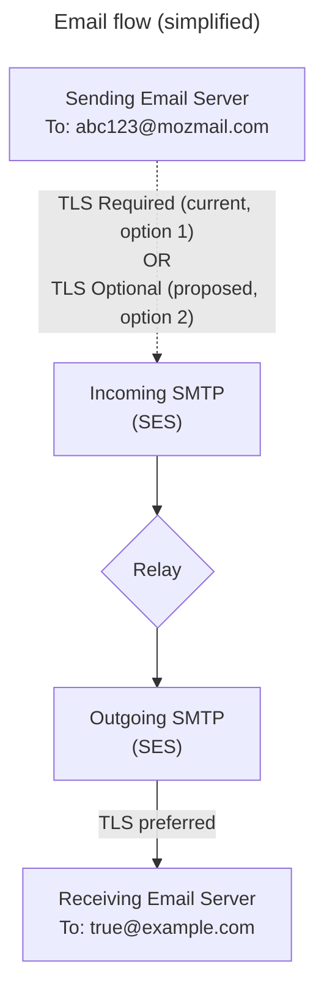

# Use Optional TLS for the Incoming SMTP Server

- Status: Accepted
- Deciders: Luke Crouch, Tony Cinotto
- Date: 2023-04-24

Technical Story: [MPP-2663](https://mozilla-hub.atlassian.net/browse/MPP-2847)

## Context and Problem Statement

Firefox Relay uses Amazon Web Service's (AWS's) [Simple Email Service][SES]
(SES) to send and receive emails. This service provides several security
features such as virus scanning and email authentication headers.

A technology called [Opportunistic Transport Layer Security][STARTTLS] (TLS)
can be used when talking to an email server over the Simple Mail Transfer
Protocol (SMTP). When TLS is used (via a `STARTTLS` command), the email is
encrypted and is not readable or changeable by a third-party. SES uses TLS to
send emails when the receiving SMTP server supports it.

Our current setting is to require TLS for incoming emails to Relay masks.
However, this causes some websites to reject Relay masks at registration. Which
TLS setting should we use?



[SES]: https://docs.aws.amazon.com/ses/latest/dg/Welcome.html
[STARTTLS]: https://en.wikipedia.org/wiki/Opportunistic_TLS

## Decision Drivers

- Relay users can protect their identity by registering with a Relay mask, and
  are more vulnerable when they can not register with a Relay mask.
- Email security is multi-faceted, and includes many optional protections. The
  largest threats should be blocked, and users should decide their own rules
  for lesser threats. When possible, Relay should provide tools and advice for
  users to support their decision.

## Considered Options

1. Keep "Required TLS" for incoming email
2. Switch to "Optional TLS" for incoming email

## Decision Outcome

Chosen option: **2. Switch to "Optional TLS" for incoming email**, because it
allows Relay masks to be used on more websites, for an acceptable level of
risk. This was implemented on 2023-04-24 ([MPP-2847][MPP_2847]), and failing
website were re-checked ([MPP-3055][MPP_3055]).

[MPP_2847]: https://mozilla-hub.atlassian.net/browse/MPP-2847
[MPP_3055]: https://mozilla-hub.atlassian.net/browse/MPP-3055

### Positive Consequences

- Relay masks are accepted on more websites. In a sample of 5 websites with
  registration issues, 4 were fixed with Optional TLS on the development server.
  The impact was less in production, with 20 of 40 websites now accepting Relay
  masks and the remaining 20 still blocking Relay masks at registration.
- Most verification emails are now delivered, with one known website still not
  delivering verification emails.

### Negative Consequences

- AWS does not provide information if an email was sent over TLS or not.
  Previously, we knew all emails were sent over TLS.
- Relay users may see more unwanted email. We have not seen customer service
  reports that can be definitely linked to this change. When comparing the week
  before (April 17 to 23) to the week after the change (May 1 to 7), the bounce
  rate increased from 0.857% to 0.958% (target is 2% or lower), and the
  complaint rate from 0.113% to 0.134% (target is 0.1% or lower). This is a
  small but acceptable increase for both rates.

## Pros and Cons of the Options

### Option 1: Keep "Required TLS" for incoming email

**Good** - With the "Required TLS" setting, we can be sure that a third party
can not view or modify the email in transit. One example from 2014 is
[ISPs in Thailand and the US][EFF_STARTTLS] stripping the `STARTTLS` flag
from SMTP sessions, making it looks like TLS was not supported and forcing
email to be sent in the clear. They may have done this to read data from the
email or to modify it in flight.

**Bad** - Many email checkers do not use `STARTTLS` when checking an email, and
report all Relay masks as invalid. Examples are the Email Dossier on
[centralops.net][CENTRALOPS] (which shows the SMTP session), and
[Kickbox][KICKBOX], a email verification provider with over 150,000 clients.

**Bad** - Some emails are discarded when TLS is required. The Google report on
[Email encryption in transit][GOOGLE_EMAIL] shows 95% of inbound emails in 2022
were sent with TLS encryption, and 5% were not. Relay users may be surprised if
5% of emails are discarded, especially if their true email provider accepts
them.

**Bad** - Requiring TLS is not compliant with RFC 3207,
[SMTP Service Extension for Secure SMTP over Transport Layer Security][RFC3207],
which states in section 4:

> A publicly-referenced SMTP server MUST NOT require use of the
> STARTTLS extension in order to deliver mail locally. This rule
> prevents the STARTTLS extension from damaging the interoperability of
> the Internet's SMTP infrastructure. A publicly-referenced SMTP
> server is an SMTP server which runs on port 25 of an Internet host
> listed in the MX record (or A record if an MX record is not present)
> for the domain name on the right hand side of an Internet mail
> address.

Our inbound SMTP server, via `dig mozmail.com MX`, is provided by AWS SES:

```
mozmail.com.		600	IN	MX	10 inbound-smtp.us-west-2.amazonaws.com.
```

[EFF_STARTTLS]: https://www.eff.org/deeplinks/2014/11/starttls-downgrade-attacks
[GOOGLE_EMAIL]: https://transparencyreport.google.com/safer-email/overview
[RFC3207]: https://www.rfc-editor.org/rfc/rfc3207
[CENTRALOPS]: https://centralops.net/co/
[KICKBOX]: https://kickbox.com/

### Option 2: Switch to "Optional TLS" for incoming email

**Good** - Relay masks will be accepted on more websites. This will protect
our user's true email.

**Good** - Valid emails from servers and clients that do not implement TLS /
`STARTTLS` will now be forwarded to Relay users.

**Bad** - Relay users will not know if an email was sent with TLS or not.
Amazon SES does not provide this data, so Relay users can't require TLS
or create filter rules based on TLS.

**Bad** - We may see an increase in unwanted emails. One mail administrator
[reports][SERVERFAULT_COMMENT]:

> I checked recently received mails on one particular mail server and found
> this. Of mails received with TLS there was 4% spam, of mails received without
> TLS there was 100% spam. I wouldn't completely block mails without TLS based
> on this, but it certainly is a strong signal, which could be utilized in spam
> filtering.

[SERVERFAULT_COMMENT]: https://serverfault.com/questions/623692/is-it-still-wrong-to-require-starttls-on-incoming-smtp-messages#comment747643_623692

## Links

- [Why do websites block Relay masks?][MPP_2922_DOC] (Mozilla-only) -
  The technical report from an investigation of risks to the Relay service
  ([MPP-2922][MPP_2922]). This identified the TLS requirement as the biggest
  cause of Relay masks being blocked at website registration.

- [Email receiving - Creating receipt rules][SES_RULES] -
  This is the AWS documentation for setting up email receiving, and includes
  the step for making inbound TLS to required or optional:

  > &#8239;8. (Optional) Under **Security and protection options**, for **Transport
  > Layer Security (TLS)**, select **Required** if you want Amazon SES to
  > reject incoming messages that aren't sent over a secure connection.

- [Is it still "wrong" to require STARTTLS on incoming SMTP messages][SERVERFAULT_Q] -
  2014 discussion of the pros and cons. The accepted answers says it should be optional.

[MPP_2922_DOC]: https://docs.google.com/document/d/10mZUt8TiVflmx-d4pIyZ2YyFZh4NOPydo1l_i4Prlhk/view
[MPP_2922]: https://mozilla-hub.atlassian.net/browse/MPP-2922
[SES_RULES]: https://docs.aws.amazon.com/ses/latest/dg/receiving-email-receipt-rules-console-walkthrough.html
[SERVERFAULT_Q]: https://serverfault.com/q/623692/3455
