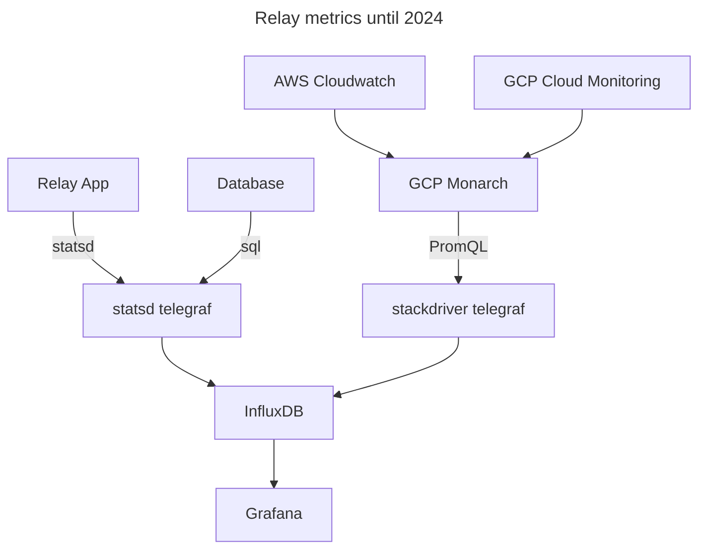
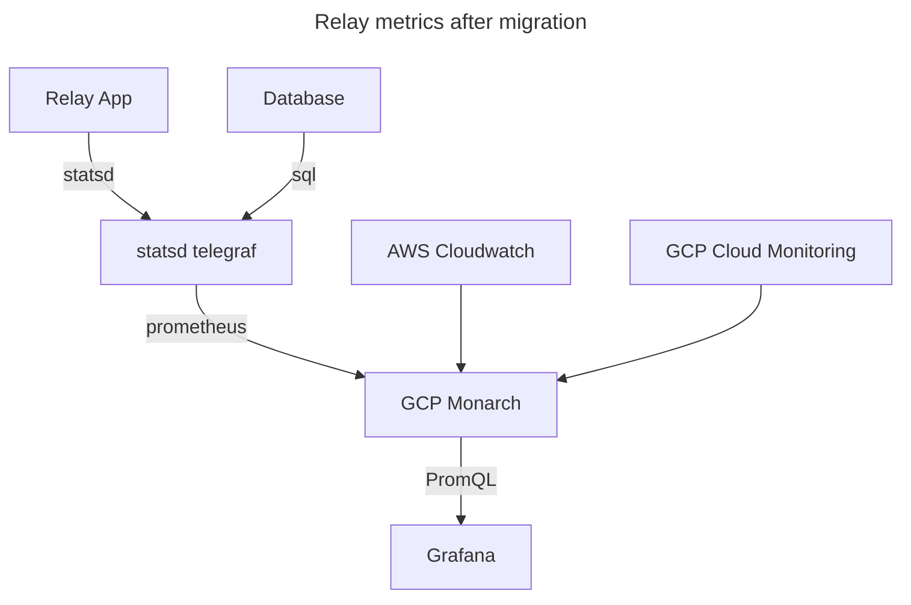

# Relay metrics and the migration to Google Managed Prometheus

- Status: Informational
- Date: 2025-02-14

## Context

Through 2024, Relay and other Mozilla services used a set of related
technologies for metrics aggregation, storage, display, and alerting:

- [InfluxDB][], a time series database, for metrics storage and queries.
- [Grafana][], an analytics and visualization tool, for dashboards and alerts.
  Both InfluxDB and Grafana are hosted by [InfluxData][].
- A "statsd" [telegraf][] instance. This instance receives counters, gauges,
  and timing events from the application, in a format known as [DogStatsD][].
  This instance also queries the database for product metrics. This instance
  writes the aggregated data to InfluxDB.
- A "stackdriver" telegraf instance. This instance reads cloud infrastructure
  data from Google Cloud Platform (GCP). This includes data for services
  running in GCP, but also Amazon Web Services (AWS) such as the [Simple Email
  Service][] (SES). This cloud metrics ingestion feature was called
  [Stackdriver] until 2020, when it was rebranded as [Observability][]. This
  telegraf instance writes the aggregated cloud infrastructure data to
  InfluxDB.

From H2 2024 through H1 2025, the SRE team is migrating to a new metrics stack:

- [Monarch][], a time-series database created by Google, for metrics storage
  and queries, provided by [Google Cloud Managed Service for Prometheus][].
- A self-hosted [Grafana][] instance, for dashboards and alerting. It will
  query Monarch directly, so the stackdriver telegraf instance is no longer
  needed.
- A "statsd" [telegraf][] instance, that will be similar to the existing
  service, including writing to the old InfluxDB database during the
  transition. However, it will also expose a [Prometheus][] endpoint with
  aggregated statistics, which will be periodically polled by the GCP
  service and written to Monarch.

During the transition period, the InfluxDB database will continue to be
populated. This will allow comparing metrics and dashboards between the
old and new environments. The SRE team is developing tools to recreate
dashboards based on PromQL, which should help in the majority of cases.
Manual work will be needed to convert the remaining panels, if possible.
The goal is to move all teams by March 2025, and to complete the
transition in June 2025.

## Outcomes

The change to the metrics backend are reflected in the system diagrams:

- Rename "Operational Metrics Platform" to "Google Managed Prometheus", and
  change relationship from "Sends metrics (Telegraf)" to "Pulls metrics
  (Prometheus)"
- Remove stackdriver telegraf from stage and production deployments

Two additional changes clarify the metrics data flow:

- Add Amazon CloudWatch as metrics source in stage and production deployments
- Correct statsd connections to be UDP, not HTTP

The changes to the metrics infrastructure has positive and negative
effect for Relay.

### Positive Consequences

- Aggregated metrics (such as average latency) are correct when queried
  directly from GCP using PromQL. This allows for accurate dashboards and
  alerts. Previously, the metrics were not copied correctly to InfluxDB. This was
  not widely known, so Relay spent wasted effort dealing with incorrect data
  ([MPP-3900][]).

### Negative Consequences

- Google Cloud Prometheus is a worse match than InfluxDB for the metrics
  emitted by the Relay application. Some issues discovered by other teams are
  counters that reset to zero or go negative, and missing data for infrequent
  events. The transition team is investigating these issues. The solution may
  involve changing how Relay emits metrics, project-level customization of the
  telegraf configuration, or abandoning statsd metrics. Until the issues are
  addressed, the data that passes through statsd telegraf should be considered
  unreliable, and cross-checked against other data like structured logs.

## Links

- [Proposal: Evolving metrics storage at Mozilla][] (_Mozilla only_) - Proposal to move off [InfluxData][] and move to Google Cloud Managed Service for Prometheus. 2023 &mdash; 2024.
- [Google Managed Prometheus][] (_Mozilla Only_) - Project page for the migration effort.

[DogStatsD]: https://docs.datadoghq.com/developers/dogstatsd/datagram_shell?tab=metrics
[Google Cloud Managed Service for Prometheus]: https://cloud.google.com/stackdriver/docs/managed-prometheus
[Google Managed Prometheus]: https://mozilla-hub.atlassian.net/wiki/spaces/IP/pages/748879873/Google+Managed+Prometheus
[Grafana]: https://en.wikipedia.org/wiki/Grafana
[InfluxDB]: https://en.wikipedia.org/wiki/InfluxDB
[InfluxData]: https://www.influxdata.com/
[MPP-3900]: https://mozilla-hub.atlassian.net/browse/MPP-3900
[Monarch]: https://research.google/pubs/monarch-googles-planet-scale-in-memory-time-series-database/
[Observability]: https://cloud.google.com/products/observability
[Prometheus]: https://en.wikipedia.org/wiki/Prometheus_(software)
[Proposal: Evolving metrics storage at Mozilla]: https://docs.google.com/document/d/1gd_f2sARvka-PsEVGQAfXRQIr1h2MRz16f-fPomjsH8/edit?usp=sharing
[Simple Email Service]: https://docs.aws.amazon.com/ses/latest/dg/Welcome.html
[Stackdriver]: https://cloud.google.com/blog/products/gcp/google-stackdriver-integrated-monitoring-and-logging-for-hybrid-cloud
[telegraf]: https://www.influxdata.com/time-series-platform/telegraf/
