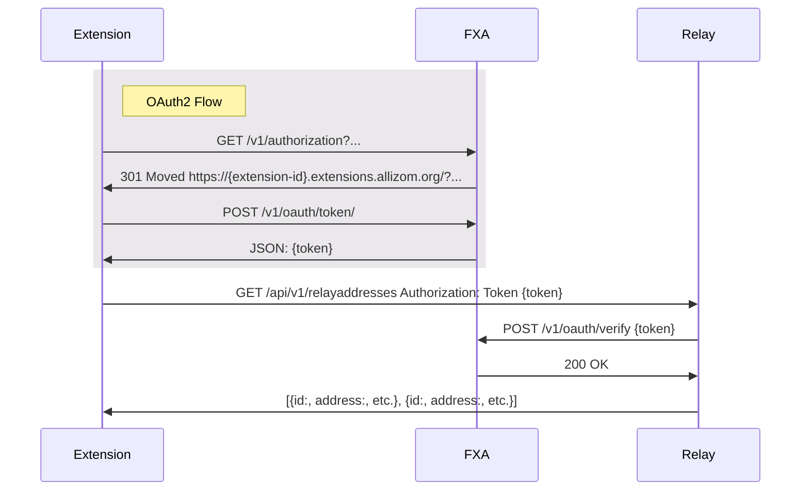

# Relay API Authentication

The Relay API is built on [Django REST Framework][drf] and authenticates
requests with any of 3 methods:

- [FXA OAuth Token Authentication](#fxa-oauth-token-authentication)
- [`SessionAuthentication`][sessionauthentication]
- [`TokenAuthentication`][tokenauthentication]

## FXA OAuth Token Authentication

Add-ons can use the [`identity.launchWebAuthFlow` API][mdn-webauthflow]
to perform an OAuth2 flow with [the FXA OAuth service][fxa-oauth], including
[PKCE][fxa-pkce].

After the OAuth flow is complete, the add-on has an FXA access token and a
long-living FXA refresh token, and authenticates all requests to the Relay
server by including an `Authorization: Bearer {fxa-access-token}` header in all
API requests. The Relay server checks the token against
[the FXA OAuth `/verify` endpoint][fxa-oauth-token-verify].

This auth scheme can be used by other clients too. E.g., Firefox browser has a
[`getOAuthToken`][searchfox-getoauthtoken] function which can be used to
perform the same API authentication as the add-on.

[drf]: https://www.django-rest-framework.org/
[sessionauthentication]: https://www.django-rest-framework.org/api-guide/authentication/#sessionauthentication
[tokenauthentication]: https://www.django-rest-framework.org/api-guide/authentication/#tokenauthentication
[mdn-webauthflow]: https://developer.mozilla.org/docs/Mozilla/Add-ons/WebExtensions/API/identity/launchWebAuthFlow
[fxa-oauth]: https://github.com/mozilla/fxa/blob/main/packages/fxa-auth-server/docs/oauth/api.md
[fxa-pkce]: https://github.com/mozilla/fxa/blob/main/packages/fxa-auth-server/docs/oauth/pkce.md
[fxa-oauth-token-verify]: https://github.com/mozilla/fxa/blob/main/packages/fxa-auth-server/docs/oauth/api.md#post-v1verify
[searchfox-getoauthtoken]: https://searchfox.org/mozilla-central/search?q=symbol:%23getOAuthToken&redirect=false
