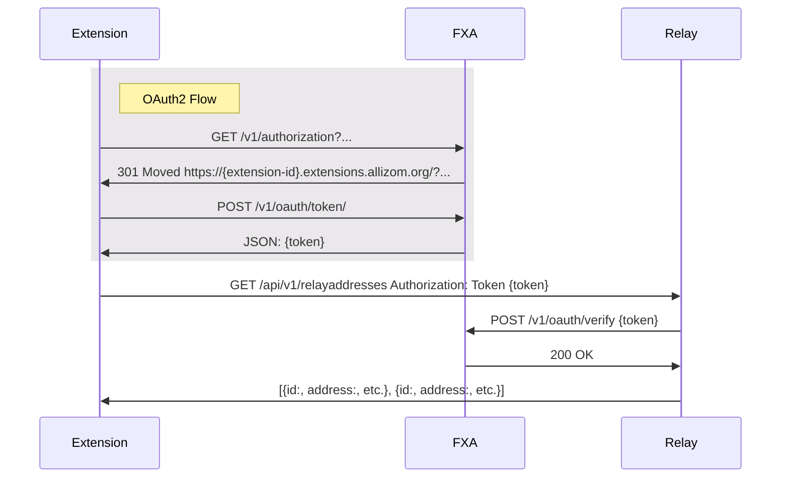
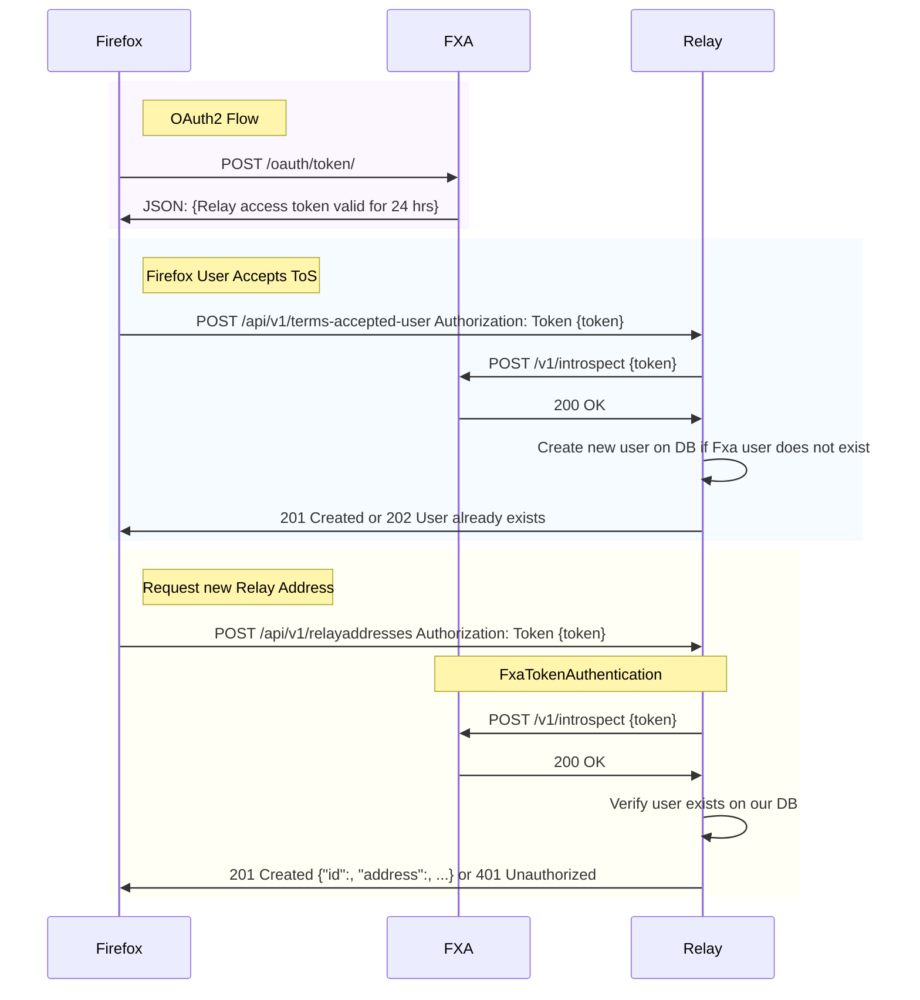

# Relay API Authentication

The Relay API is built on [Django REST Framework][drf] and authenticates
requests with any of 3 methods:

- [FXA OAuth Token Authentication](#fxa-oauth-token-authentication): Used by Firefox
  browsers
- [`SessionAuthentication`][sessionauthentication]: Used by the add-on "first run" to fetch a token
- [`TokenAuthentication`][tokenauthentication]: Used by the add-on and React website

## FXA OAuth Token Authentication

Clients can perform an OAuth2 flow with [the FXA OAuth service][fxa-oauth] to receive a
24-hour relay-scoped FXA access token and a long-living FXA refresh token. For example:

- Add-ons can use [`identity.launchWebAuthFlow` API][mdn-webauthflow].
- Firefox Desktop can use [`getOAuthToken`][searchfox-getoauthtoken] and [`accessTokenWithSessionToken`][searchfox-accesstokenwithsessiontoken].

Clients should request `scope: ["https://identity.mozilla.com/apps/relay"]` to get a
relay-scoped access token.

After the OAuth flow is complete, the client authenticates all requests to the Relay
server by including an `Authorization: Bearer {fxa-access-token}` header in all
API requests. The Relay server checks the token against
[the FXA OAuth `/verify` endpoint][fxa-oauth-token-verify].

Note: It is up to the client to use the long-living refresh token to obtain a new access
token when an old access token expires.

### Accepting Terms of Service

Firefox browsers must first `POST` to the Relay `/api/v1/terms-accepted-user` endpoint
to state that the user accepted the Terms of Service. This `POST` will also create the
new user and profile records in Relay.

### Debugging tip

To spot-check the Relay API endpoint with an FXA OAuth token, use a tool like the
[Firefox desktop browser toolbox][browser-toolbox] [Network Monitor][network-monitor] to
inspect requests to `relay.firefox.com/api/v1/`, and copy the value of the
`Authorization` header.

[drf]: https://www.django-rest-framework.org/
[sessionauthentication]: https://www.django-rest-framework.org/api-guide/authentication/#sessionauthentication
[tokenauthentication]: https://www.django-rest-framework.org/api-guide/authentication/#tokenauthentication
[mdn-webauthflow]: https://developer.mozilla.org/docs/Mozilla/Add-ons/WebExtensions/API/identity/launchWebAuthFlow
[fxa-oauth]: https://mozilla.github.io/ecosystem-platform/api#tag/OAuth-Server-API-Overview
[fxa-pkce]: https://github.com/mozilla/fxa/blob/main/packages/fxa-auth-server/docs/oauth/pkce.md
[fxa-oauth-token-verify]: https://mozilla.github.io/ecosystem-platform/api#tag/OAuth-Server-API-Overview/operation/postVerify
[searchfox-getoauthtoken]: https://searchfox.org/mozilla-central/search?q=symbol:%23getOAuthToken&redirect=false
[searchfox-accesstokenwithsessiontoken]: https://searchfox.org/mozilla-central/search?q=symbol:%23accessTokenWithSessionToken&redirect=false
[browser-toolbox]: https://firefox-source-docs.mozilla.org/devtools-user/browser_toolbox/index.html
[network-monitor]: https://firefox-source-docs.mozilla.org/devtools-user/network_monitor/index.html
