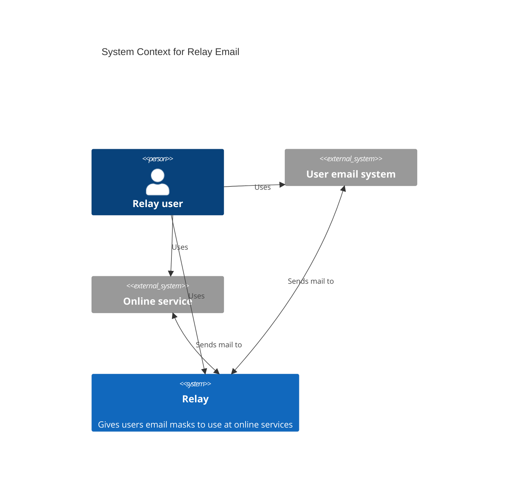

```mermaid
C4Context
    title System Context for Relay Email
    Person(customer, "Relay user")
    System_Ext(user_email, "User email system")
    System_Ext(external, "Online service")
    System(relay, "Relay", "Gives users email masks to use at online services")

    Rel(customer, relay, "Uses")
    Rel(customer, user_email, "Uses")
    Rel(customer, external, "Uses")
    BiRel(external, relay, "Sends mail to")
    BiRel(user_email, relay, "Sends mail to")

    UpdateLayoutConfig($c4ShapeInRow="3")
```
