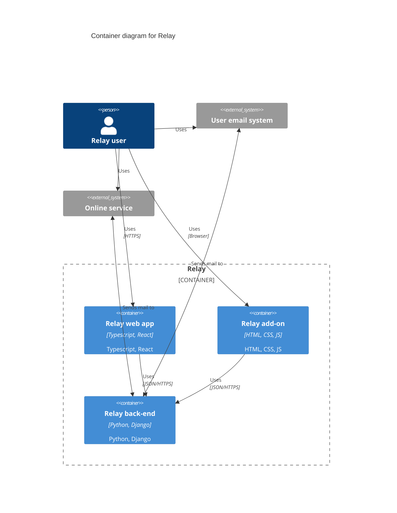

```mermaid
C4Container
    title Container diagram for Relay
    Person(customer, "Relay user")
    System_Ext(user_email, "User email system")
    System_Ext(external, "Online service")

    Container_Boundary(relay_container, "Relay"){
        Container(relay_web, "Relay web app", "Typescript, React", "Typescript, React")
        Container(relay_addon, "Relay add-on", "HTML, CSS, JS", "HTML, CSS, JS")
        Container(relay_backend, "Relay back-end", "Python, Django", "Python, Django")
    }


    Rel(customer, relay_web, "Uses", "HTTPS")
    Rel(customer, relay_addon, "Uses", "Browser")
    Rel(relay_addon, relay_backend, "Uses", "JSON/HTTPS")
    Rel(relay_web, relay_backend, "Uses", "JSON/HTTPS")
    Rel(customer, user_email, "Uses")
    Rel(customer, external, "Uses")
    BiRel(external, relay_backend, "Sends mail to")
    BiRel(user_email, relay_backend, "Sends mail to")

    UpdateLayoutConfig($c4ShapeInRow="3")
```
