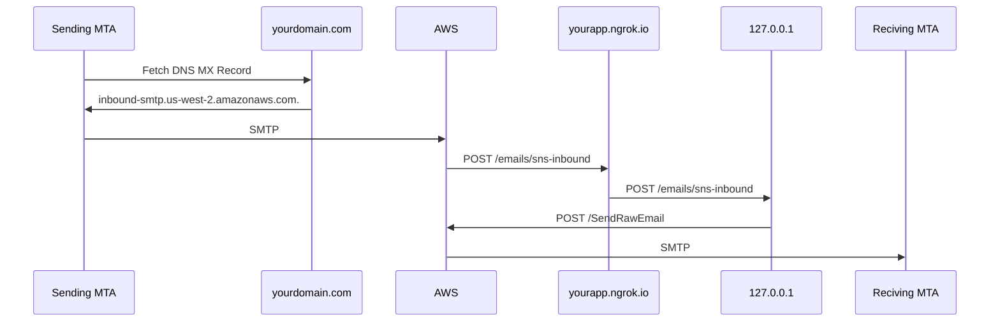

# End-to-end Local Development
Rather than operate SMTP directly, Relay uses AWS SES via HTTPS. So, a full
local end-to-end setup works like this:



## Requirements

* Your own domain and the ability to publish MX and CNAME records to it
* AWS account
* (Suggested) [ngrok.io][ngrok] account

## Overview
At a high level, you will need to:

1. Publish an MX record at your domain pointing to AWS SES
2. Set up your AWS SES to send emails TO your app via HTTPS
3. Configure your app to accept emails addressed to your domain
4. Set up your AWS SES to send emails FROM your app
5. Send a test email


### Publish MX at your domain
When a sending Mail Transfer Agents (MTA) delivers email to a domain, it 
queries that domain's DNS for an MX record. The MX record is the address of 
the SMTP server to which the sending MTA can connect. For Relay, that SMTP 
server is AWS. So:

1. Go to your domain's DNS and add a new MX record pointing to your AWS
   region. E.g.:
   * Hostname: `*`
   * Priority: 10
   * Server: inbound-smtp.us-east-1.amazonaws.com
   * TTL: 15


### Set up your AWS SES to send emails TO your app via HTTPS
Since AWS will accept SMTP traffic from MTAs sending email to your domain,
you will need to verify your domain ownership for AWS. Then, configure
SES to send all inbound email to your app (via SNS HTTPS subscription). A
helpful tool for this is [ngrok][ngrok], which can proxy a public domain to
your 127.0.0.1 server.

#### Verify your domain ownership
AWS needs to verify you own the domain before it will send its email to you.

1. [Create a new domain identity][create-new-identity] in your SES "Verified
   identities" panel. (Note: You do NOT need to set up DKIM for local dev.)
2. Go to your domain's DNS and add the new CNAME records with the values that
   SES generated for you.

#### (Suggested) Use ngrok to make your local server available
When SES sends email thru an SNS HTTPS subscription, it is helpful to have a
permanent public domain that proxies your local server. [ngrok](ngrok) is a
handy tool for this.

Note: This will NOT be the domain of the email aliases for your local server.

To run `ngrok` with a [custom subdomain][ngrok-custom-subdomain]:

```
ngrok http -subdomain=myrelay 8000
```

You should see output containing:

```
Forwarding      https://myrelay.ngrok.io -> 127.0.0.1:8000
```

#### Create SNS topic subscription that sends HTTPS POSTs to your local server
To confirm an SNS HTTPS topic subscription, you need to receive and visit a
confirmation link from AWS. But Relay also checks HTTPS POSTs are for the
proper Topic ARN, so you need to do these steps in this order:

1. In your [SNS Topics panel][sns-topic-panel], create a new topic.
2. Set the env var for that topic's ARN: `AWS_SNS_TOPIC="arn:aws:sns...`
3. `python manage.py runserver`
4. In that topic, create a subscription with HTTPS protocol, with your local
   Relay domain endpoint. e.g., `https://myrelay.ngrok.io/emails/sns-inbound`
5. In your local `runserver` console, find the `SubscribeURL` and visit that
   url.

#### Configure SES to send email to your SNS topic
1. In your [SES Email Receiving][ses-email-receiving] panel, create a new rule
   set.
2. In that rule set, create a rule "ses-all-inbound-to-sns"
3. In that rule, add an action to publish to SNS topic and select the SNS
   topic you made before.

### Configure your app to accept emails addressed to your domain
Django and our Relay code have checks to make sure the HTTPS POSTs are for the
right domain. So, you'll need to set some environment variable values:

* `DJANGO_ALLOWED_HOST=127.0.0.1,yourdomain.com`
* `MOZMAIL_DOMAIN=yourdomain.com`
* `RELAY_FROM_ADDRESS=relay@yourdomain.com`

Note again: These are NOT your ngrok.io domain.

### Set up your AWS SES to send emails FROM your app
The last part of Relay is sending emails FROM the Relay app to the real email
addresses of the owners of Relay aliases. You will need to create an AWS SES
Configuration set for your local Relay server. And, while in SES "sandbox"
mode, you need to add one of your own email addresses as a verified identity.

1. [Create an SES configuration set][create-ses-config].
   * (All defaults are fine)
2. Set the AWS env vars:
   * `AWS_SES_CONFIGSET`, `AWS_REGION`, `AWS_ACCESS_KEY_ID`,
     `AWS_SECRET_ACCESS_KEY`
2. [Create a new verified identity][create-new-identity] email address.
   * AWS will send you a confirmation link to the address.
3. Register a local Relay user with this email address.
4. Create an alias with this Relay user.

### Send a test email

1. Run your local Relay server and ngrok:
   * `python manage.py runserver`
   * `ngrok http -subdomain=myrelay 8000`
2. Go to your favorite email address and send an email to the Relay alias you
   generated above.
3. You should see a POST to `/emails/sns-inbound` in your `runserver` process!


[create-new-identity]: https://console.aws.amazon.com/ses/home?region=us-east-1#/verified-identities/create
[ses-email-receiving]: https://console.aws.amazon.com/ses/home?region=us-east-1#/email-receiving
[ngrok]: https://ngrok.com/
[ngrok-custom-subdomain]: https://ngrok.com/docs#http-subdomain
[sns-topic-panel]: https://console.aws.amazon.com/sns/v3/home?region=us-east-1#/topics
[create-ses-config]: https://console.aws.amazon.com/ses/home?region=us-east-1#/configuration-sets/create
