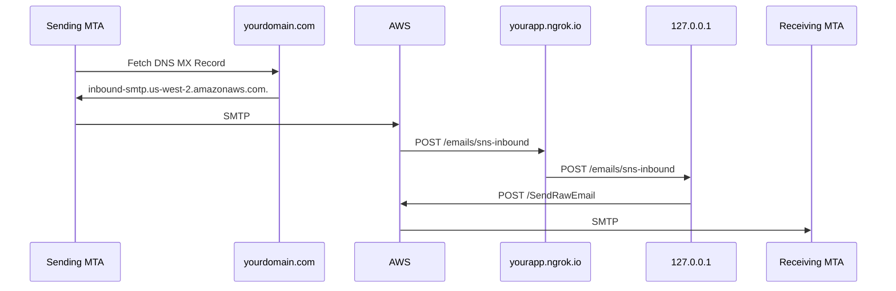
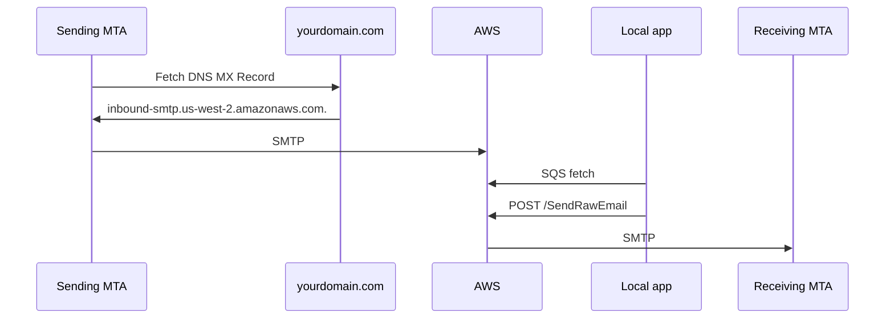

# End-to-end Local Development
Rather than operate SMTP directly, Relay uses AWS SES via HTTPS. So, a full
local end-to-end setup works like this:



## Requirements

* Your own domain and the ability to publish MX and CNAME records to it
* AWS account
* (Suggested) [ngrok.io][ngrok] account
* Enable Firefox Accounts authentication (see README)

## Overview
At a high level, you will need to:

1. Publish an MX record at your domain pointing to AWS SES
2. Set up your AWS SES to send emails TO your app via HTTPS
3. Configure your app to accept emails addressed to your domain
4. Set up your AWS SES to send emails FROM your app
5. Send a test email
6. (Optional) [Convert to store in S3](#convert-to-store-in-s3)
7. (Optional) [Convert to back-end processing](#convert-to-back-end-processing)

### Publish MX at your domain
When a sending Mail Transfer Agents (MTA) delivers email to a domain, it 
queries that domain's DNS for an MX record. The MX record is the address of 
the SMTP server to which the sending MTA can connect. For Relay, that SMTP 
server is AWS. So:

1. Go to your domain's DNS and add a new MX record pointing to your AWS
   region. E.g.:
   * Hostname: `*`
   * Priority: 10
   * Server: inbound-smtp.us-east-1.amazonaws.com
   * TTL: 15


### Set up your AWS SES to send emails TO your app via HTTPS
Since AWS will accept SMTP traffic from MTAs sending email to your domain,
you will need to verify your domain ownership for AWS. Then, configure
SES to send all inbound email to your app (via SNS HTTPS subscription). A
helpful tool for this is [ngrok][ngrok], which can proxy a public domain to
your 127.0.0.1 server.

#### Verify your domain ownership
AWS needs to verify you own the domain before it will send its email to you.

1. [Create a new domain identity][create-new-identity] in your SES "Verified
   identities" panel. AWS will set up "Easy DKIM" with 3 CNAME records, which
   will work for local dev.
2. Go to your domain's DNS and add the new CNAME records with the values that
   SES generated for you.

#### (Suggested) Use ngrok to make your local server available
When SES sends email thru an SNS HTTPS subscription, it is helpful to have a
permanent public domain that proxies your local server. [ngrok](ngrok) is a
handy tool for this.

Note: This will NOT be the domain of the email aliases for your local server.

To run `ngrok` with a [custom subdomain][ngrok-custom-subdomain]:

```
ngrok http -subdomain=myrelay 127.0.0.1:8000
```

You should see output containing:

```
Forwarding      https://myrelay.ngrok.io -> 127.0.0.1:8000
```

Add the ngrok.io domain to the allowed hosts:

* `DJANGO_ALLOWED_HOST=127.0.0.1,myrelay.ngrok.io`

In a different console, run the development server. Ensure:

* The destination host works, such as http://127.0.0.1:8000
* The ngrok.io hostname works, such as https://myrelay.ngrok.io

Firefox Accounts authentication doesn't work with multiple domains. Most
developers will continue to log in with FxA at http://127.0.0.1:8000

#### Create SNS topic subscription that sends HTTPS POSTs to your local server
To confirm an SNS HTTPS topic subscription, you need to receive and visit a
confirmation link from AWS. But Relay also checks HTTPS POSTs are for the
proper Topic ARN, so you need to do these steps in this order:

1. In your [SNS Topics panel][sns-topic-panel], create a new topic.
2. Set the env var for that topic's ARN: `AWS_SNS_TOPIC="arn:aws:sns...`
3. `python manage.py runserver`
4. In that topic, create a subscription with HTTPS protocol, with your local
   Relay domain endpoint. e.g., `https://myrelay.ngrok.io/emails/sns-inbound`
5. In your local `runserver` console, find the `SubscribeURL` and visit that
   url.

#### Configure SES to send email to your SNS topic
1. In your [SES Email Receiving][ses-email-receiving] panel, create a new rule
   set.
2. In that rule set, create a rule "ses-all-inbound-to-sns"
3. In that rule, add an action to Publish to Amazon SNS topic and select the SNS
   topic you made before. Use UTF-8 encoding instead of Base64.
4. In [SES Email Receiving][ses-email-receiving], ensure the rule
   "ses-all-inbound-to-sns" is Active.


### Configure your app to accept emails addressed to your domain
Django and our Relay code have checks to make sure the HTTPS POSTs are for the
right domain. So, you'll need to set some environment variable values:

* `MOZMAIL_DOMAIN=yourdomain.com`
* `RELAY_FROM_ADDRESS=relay@yourdomain.com`

Note again: These are NOT your ngrok.io domain.

### Set up your AWS SES to send emails FROM your app
The last part of Relay is sending emails FROM the Relay app to the real email
addresses of the owners of Relay aliases. You will need to create an AWS SES
Configuration set for your local Relay server. And, while in SES "sandbox"
mode, you need to add one of your own email addresses as a verified identity.

1. [Create an SES configuration set][create-ses-config].
   * (All defaults are fine)
2. Set the AWS env vars:
   * `AWS_SES_CONFIGSET`
   * `AWS_REGION`
   * `AWS_ACCESS_KEY_ID` *Must be set in the environment, not just in .env*
   * `AWS_SECRET_ACCESS_KEY` *Also must be set in the environment*
2. [Create a new verified identity][create-new-identity] email address.
   * AWS will send you a confirmation link to the address.
3. Register a local Relay user with this email address.
4. Create an alias with this Relay user.

### Send a test email

1. Run your local Relay server and ngrok:
   * `python manage.py runserver 127.0.0.1:8000`
   * `ngrok http -subdomain=myrelay 127.0.0.1:8000`
2. Go to your favorite email address and send an email to the Relay alias you
   generated above.
3. You should see a POST to `/emails/sns-inbound` in your `runserver` process!
4. You should see the test email in the Inbox of the final destination/recipient of the alias!
   * Note: the final destination/recipient address for the alias must be in your SES "verified identities" for SES to actually send it emails. 


[create-new-identity]: https://console.aws.amazon.com/ses/home?region=us-east-1#/verified-identities/create
[ses-email-receiving]: https://console.aws.amazon.com/ses/home?region=us-east-1#/email-receiving
[ngrok]: https://ngrok.com/
[ngrok-custom-subdomain]: https://ngrok.com/docs#http-subdomain
[sns-topic-panel]: https://console.aws.amazon.com/sns/v3/home?region=us-east-1#/topics
[create-ses-config]: https://console.aws.amazon.com/ses/home?region=us-east-1#/configuration-sets/create


## <a name="convert-to-store-in-s3"></a> (Optional) Convert to store in S3

In Q1 2022, we adjusted AWS SES to store emails in S3 before adding them to
SNS. This allows emails that are larger than an SNS message (150K), such as
emails with large attachments.

The steps to setup S3 transfer:

1. Add an encryption key
2. Convert AWS SES to store emails in a new S3 bucket
3. Configure the new AWS S3 bucket
4. Allow the app AWS user to access the S3 bucket
5. Send a test email

### Add an encryption key

By adding the encryption key first, the AWS console will be able to add
permissions as we use it.

* Load the [Customer managed keys][customer-managed-keys] page, and select "Create Key"
    * Step 1: Configure key
        * Key type: Symmetric
        * Advanced options: defaults are OK:
            - Key material origin: KMS
            - Regionality: Single-Region key
        * Click "Next"
    * Step 2: Add labels
        * Alias: RelayKey or similar
        * Description: This key is used to encrypt incoming SES messages processed by SNS, SQS, and S3.
        * Tags: *None*
        * Click "Next"
    * Step 3: Define key administrative permissions
        * Key administrators: Add your login user, if applicable
        * Key deletion: Select Allow key administrators to delete this key (default)
        * Click "Next"
    * Step 4: Define key usage permissions
        * This account: Add the app key user, if applicable
        * Other AWS accounts: *None*
    * Step 5: Review
        * Add the statement below to the key policy
        * Click "Finish"

This Key Policy statement (change ``111122223333`` to your account number)
allows SES to access the key. Add it to key policy with the other statements:

```json
{
  "Sid": "AllowSESToEncryptMessagesBelongingToThisAccount",
  "Effect": "Allow",
  "Principal": {
    "Service":"ses.amazonaws.com"
  },
  "Action": [
    "kms:GenerateDataKey*",
    "kms:Encrypt",
    "kms:Decrypt"
  ],
  "Resource": "*",
  "Condition":{
    "StringEquals":{
      "AWS:SourceAccount":"111122223333"
    },
    "StringLike": {
      "AWS:SourceArn": "arn:aws:ses:*"
    }
  }
}
```

[customer-managed-keys]: https://us-east-1.console.aws.amazon.com/kms/home?region=us-east-1#/kms/keys

### Convert AWS SES to store emails in a new S3 bucket

1. Go to [SES Email Receiving][ses-email-receiving].
2. Select the ruleset ``ses-all-inbound-to-sns``
3. Select the rule ``ses-all-inbound-to-sns``
4. Select the "Actions" tab, and the "Edit"
    - Step 3: Add actions:
        * Click "Remove" to remove "Publish to Amazon SNS topic"
        * In "Add new action", select "Deliver to S3 bucket"
        * S3 bucket: Select "Create S3 bucket", and select a name like "fxrelay-emails-myusername"
        * Object key prefix: emails
        * Message encryption: De-select Enable (default)
        * SNS topic: Select your existing SNS topic
        * Click Next
    - Review:
        * Step 3 now shows "S3Action" for Action type
        * Click "Save changes"

### Configure the new AWS S3 Bucket

On the [S3 Buckets page][s3-buckets-page], select your new bucket to view details.

There will be a single object, `emails/AMAZON_SES_SETUP_NOTIFICATION`, which
contains a fake email saying that SES is delivering to this S3 bucket.

These changes needed to line up with other deployments:

* Properties - enable server-side encryption
* Permissions - disabled public access
* Management - delete after 3 days

[s3-buckets-page]: https://s3.console.aws.amazon.com/s3/buckets?region=us-east-1

#### Update Properties - Enable encryption
On the **Properties** tab:

* In the "Default encryption" section, select "Edit":
    - Server-side encryption: select Enable
    - Encryption key type: AWS Key Management Service key (SSE-KMS)
    - AWS KMS key: Choose from your AWS KMS keys, select the RelayKey
    - Bucket Key: Enable
    - Select "Save Changes"

#### Update Permissions

On the **Permissions** tab:

* In the "Block public access (bucket settings), select "Edit":
    - Select "Block *all* public access"
    - Select "Save Changes"
    - Type "confirm" to confirm

#### Update Management

On the **Management** tab:

* In the "Lifecycle rules" section (top), select "Create lifecycle rule"
    * Lifecycle rule configuration
        * Lifecycle rule name: ``delete-expired``
        * Choose a rule scope: Leave at "Limit the scope of this rule using one or more filters"
        * Filter type - Prefix: ``emails/``
        * Leave with no tags, and no object size filters
    * Lifecycle rule actions
        * Select option 3, "Expire current versions of objects". For an
          unversioned bucket, this deletes the object.
    * Expire current versions of objects (this section appears after selecting the action)
        * Days after object creation: 3
    * Review transition and expiration actions (read-only, confirms settings)
        * Current version actions:
            * Day 0: Objects uploaded
            * Day 3: Objects expire
        * Noncurrent versions actions
            * Day 0: No actions defined.
    * Select "Create rule" to return to the Lifecycle Configuration details.
    * Select the bucket name from the breadcrumbs to return to bucket details

### Allow the app AWS user to manage the S3 bucket
Starting at the [Identity and Access Management (IAM) Dashboard][iam-dashboard],
add the full access policy to the AWS user that you use from the app:

```
arn:aws:iam::aws:policy/AmazonS3FullAccess
```

or add the specific permissions needed by the app:

```
ListBucket (optional)
GetObject
DeleteObject
```

You'll need the bucket permission (like ``arn:aws:s3:::fxrelay-emails-myusername``)
for ``ListBucket``, and object permission (like
``arn:aws:s3:::fxrelay-emails-myusername/*``) for ``GetObject`` and ``DeleteObject``.

[iam-dashboard]: https://us-east-1.console.aws.amazon.com/iamv2/home#/home

### Send a test email

Same as before:

1. Run your local Relay server and ngrok:
   * `python manage.py runserver 127.0.0.1:8000`
   * `ngrok http -subdomain=myrelay 127.0.0.1:8000`
2. Go to your favorite email address and send an email to the Relay alias you
   generated above.
3. You should see a POST to `/emails/sns-inbound` in your `runserver` process!
4. You should see the test email in the Inbox of the final destination/recipient of the alias!
   * Note: the final destination/recipient address for the alias must be in your SES "verified identities" for SES to actually send it emails. 

One way to see the S3 object is to add a breakpoint to your local code,
so that you can examine the object in the AWS console before it is deleted.
However, SNS will quickly try the request again, so be fast!

## <a name="convert-to-back-end-processing"></a> (Optional) Convert to back-end processing

*Note: this change is not yet in production*

In Q2 2022, we are switching from handling email as a web request, POSTed via
an SNS subscription, to a back-end process, pulling from a Simple Queue Service
(SQS) queue.




To make this change:

* (Optional) Add a dead-letter queue
* Add an SQS queue
* Enable the app user to read from the queue
* Turn off the SNS push subscription
* Subscribe to SNS topic
* Run the email task

### (Optional) Add a dead-letter queue
In production, undeliverable SNS messages are sent to a dead-letter queue
(DLQ). They can be undeliverable because the service is unavailable, or because
the email is malformed, or processing is broken. An SQS queue can also have a
dead-letter queue.  If you have a SNS DLQ, you can use it for the SQS DLQ as
well. If not, you can create it.

On the [SQS dashboard][sqs-dashboard], select "Create Queue":

* Details
    * Type: Standard
    * Name: `fx-relay-emails-dlq`
* Select "Create Queue" to accept other defaults.

### Add an SQS queue

On the [SQS dashboard][sqs-dashboard], select "Create Queue":

* Details
    * Type: Standard
    * Name: `fx-relay-emails`
* Dead-letter queue - *Optional* - If you created one in the previous step:
    * Set this queue to receive undeliverable messages: Enabled
    * Choose Queue: The ARN for `fx-relay-emails-dlq`
    * Maximum receives: 3
* Select "Create queue"

### Enable the app user to read from the queue
Starting at the [Identity and Access Management (IAM) Dashboard][iam-dashboard],
add the full access policy to the AWS user that you use from the app:

```
arn:aws:iam::aws:policy/AmazonSQSFullAccess
```

or add the specific permissions needed by the app:

* ``sqs:ReceiveMessage`` - Needed to read messages
* ``sqs:DeleteMessage`` - Needed to removed messages
* ``sqs:ChangeMessageVisibility`` - Needed to reserve a message when reading
* ``sqs:GetQueueAttributes`` - Needed to get (approximate) queue sizes

### Turn off the SNS push subscription

On the [SNS Topics dashboard][sns-topic-panel]:

* Select the relay topic
* Select radio button to the left of the `/emails/sns-inbound` subscription
* Select "Delete"
* Confirm "Delete"

### Subscribe to SNS topic

Back on the [SQS dashboard][sqs-dashboard], select the queue.
In the "SNS Subscriptions" tab:

* Select "Subscribe to Amazon SNS topic"
* In the "Amazon SNS topic" panel, choose the relay topic
* Select "Save"

### Run the email task

Set environment variables:

* `AWS_ACCESS_KEY_ID`
* `AWS_SECRET_ACCESS_KEY`
* `AWS_SQS_EMAIL_QUEUE_URL`: The URL of the `fx-relay-emails` queue
* `AWS_SQS_EMAIL_DLQ_URL`: The URL of the `fx-relay-emails-dlq` queue, if
  configured, otherwise omit or set to an empty string (``""``)

These URLs can be found by starting at the [SQS dashboard][sqs-dashboard] and
clicking on the queue name to view details.

Run the email task:

```
./manage.py process_emails_from_sqs
```

Go to your favorite email client and send an email to your Relay alias. In a
few seconds, you'll see log messages about the email being processed, and then
the test email in the Inbox of the final destination/recipient of the alias!.
