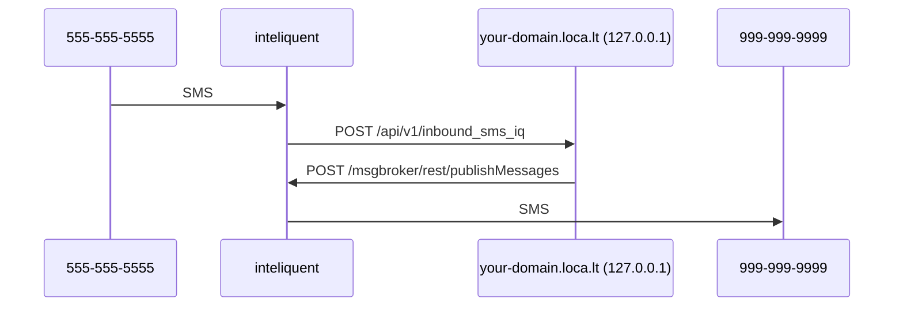

# End-to-end Local Phone Development

Relay uses inteliquent HTTP APIs for phone numbers, texts, and calls.
So, a full local end-to-end phone setup works like this:

## Requirements

- inteliquent access (ping @groovecoder)
- [`localtunnel`](https://localtunnel.github.io/www/)

## Overview

To make your local Relay SEND messages you will:

1. Add the inteliquent API key to your environment variables

To make your local Relay RECEIVE messages you will also:

1. Use `localtunnel` to publish your local app at a public domain
2. Set up inbound message webhook in inteliquent (ping @groovecoder)
3. Receive a test message

### Send messages

#### Configure local to enable inteliquent

1. Add `PHONES_ENABLED=True`
2. Add `IQ_ENABLED=True`
3. Add `IQ_OUTBOUND_API_KEY=` (ping @groovecoder for this)
4. Add `IQ_INBOUND_API_KEY=` (ping @groovecoder for this)

#### Send a test message (Pending)

Now you're ready to send a test message to make sure inteliquent is configured
correctly. The first message in the Relay phone flow is the verification code:

1. Use http://127.0.0.1:8000/admin/waffle/flag/ to give the `phones` waffle flag to a
   user
2. Sign in as that user at http://127.0.0.1:8000/
3. Go to [the staging "Relay Email & Phone Protection (127.0.0.1)" purchase page][buy-fonez] and buy a phone
   subscription for the user. (Use a [Stripe testing card][stripe-test-cards] like
   `4242424242424242`)
4. (PENDING) Go to http://127.0.0.1:8000/phone/ and verify your real phone: it will (soon) send an SMS
   via inteliquent

[buy-fonez]: https://accounts.stage.mozaws.net/subscriptions/products/prod_LgQiSgNi4xL7dq
[stripe-test-cards]: https://stripe.com/docs/testing#cards

### Receive messages

#### Use `localtunnel` to publish your local app at a public domain

Relay receives webhook requests from inteliquent, so your local Relay app needs to
be accessible at a public domain. [`localutnnel`][lt-download] is a great tool to
make this easier.

1. Follow the instructions on the [`localtunnel`][lt-download].
2. Add `your-subdomain.loca.lt` to your `.env` `DJANGO_ALLOWED_HOST`
3. Set your `.env` `SITE_ORIGIN` to `your-subdomain.loca.lt`
4. Run `lt --port 8000 --subdomain your-subdomain`
5. Hit https://your-subdomain.loca.lt/api/v1/docs/ to check that it's working.

[lt-download]: https://localtunnel.github.io/www/

#### Set up a local Relay number to receive and forward messages

With `localtunnel` and inteliquent set up, you're now ready to set up a local Relay
number to receive and forward messages to your real phone.

Until the UI flow is done, you'll need to use the admin UI to do this:

1. Go to http://127.0.0.1:8000/admin/phones/realphone/add/
   - Number: your real phone number
   - Verified: checked
2. Click "Save"
3. Get an inteliquent number (tell @groovecoder your-subdomain.loca.lt)
4. Go to http://127.0.0.1:8000/admin/phones/relaynumber/add/
   - Number: inteliquent number
   - Vendor: inteliquent
   - Location: US
5. Click "Save"
6. Send a text message to your relay number.
7. (Note) Replies are not working yet; will be handled in a future PR

- You should see the inteliquent webhook request in your local runserver and you
  should receive the text message to your real phone!
