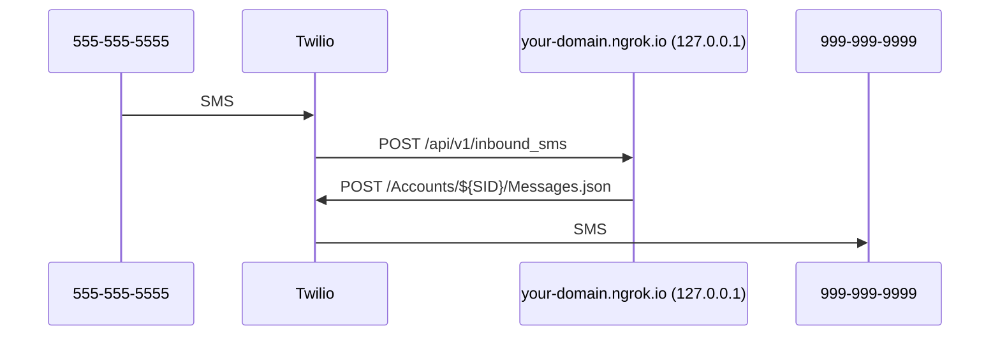

# End-to-end Local Phone Development
Relay uses Twilio HTTP APIs for phone numbers, texts, and calls.
So, a full local end-to-end phone setup works like this:



## Requirements

* Twilio account
* (Suggested) Premium ngrok.com account

## Overview
To make your local Relay SEND messages you will:

1. Create a Twilio account
2. Set up a "main" Relay number in Twilio
3. Send a test message

To make your local Relay RECEIVE messages you will also:

1. Use `ngrok` to publish your local app at a public domain
2. Set up a Relay SMS application in Twilio
3. Receive a test message


### Send messages

#### Create a Twilio account
1. Make a regular Twilio account and "Upgrade" it so you can buy a number.
2. Go to the ["Console"][console] main page
3. Copy the "Account SID" value into your `.env` `TWILIO_ACCOUNT_SID`
4. Copy the "Auth Token" value into your `.env` `TWILIO_AUTH_TOKEN`

[console]: https://console.twilio.com


#### Set up a "main" Relay number in Twilio
Relay sends its own messages to users (e.g., the text message to verify their
real number) from its own "main" phone number. So, you need to buy a main phone
number for Relay and set it to your `TWILIO_MAIN_NUMBER` env var.

1. Go to the ["Buy a number"][buy-number] page in your Twilio account.
2. Buy a number that has Voice, SMS, and MMS capabilities.
3. In your `.env` set `TWILIO_MAIN_NUMBER='<your-number-in-es164-format>'`

[buy-number]: https://console.twilio.com/us1/develop/phone-numbers/manage/search?frameUrl=%2Fconsole%2Fphone-numbers%2Fsearch


#### Send a test message
Now you're ready to send a test message to make sure Twilio is configured
correctly. The first message in the Relay phone flow is the verification code:

1. Sign in at http://127.0.0.1:8000/.
2. Go to [the staging "Relay fonez" purchase page][buy-fonez] and buy a phone
   subscription for the user.
3. Use the `POST /api/v1/realphone/` API endpoint to trigger a verification
   text message.
   * Go to http://127.0.0.1:8000/api/v1/docs/
   * Scroll down to `POST /realphone/`
   * Click "Try it out"
   * Enter your real number e.g., `{"number": "+12223334444"}`
   * Click "Execute"

[buy-fonez]: https://accounts.stage.mozaws.net/subscriptions/products/prod_LgQiSgNi4xL7dq


### Receive messages

#### Use `ngrok` to publish your local app at a public domain
Relay receives webhook requests from Twilio, so your local Relay app needs to
be accessible at a public domain. [`ngrok`][ngrok-download] is a great tool to
make this easier.

1. Follow the instructions on the [ngrok download page][ngrok-download].
2. Put this tunnel config in the `tunnels` section of your
   `~/.ngrok2/ngrok.yml` file:
   ```
   relay:
        proto: http
        addr: 127.0.0.1:8000
        subdomain: pick-a-subdomain
   ```
   Note: You will need ngrok premium to get a static subdomain.
3. Add `your-subdomain.ngrok.io` to your `.env` `DJANGO_ALLOWED_HOST`
4. Run `ngrok start relay`
5. Hit https://your-subdomain.ngrok.io/api/v1/docs/ to check that it's working.

[ngrok-download]: https://ngrok.com/download


#### Set up a Relay SMS application in Twilio
Relay has a webhook URL to receive all text messages sent to all Relay numbers.
Rather than set this webhook URL separately for every Relay number, Relay uses
single SMS application to assign a single webhook URL value for the entire
application. So, you need to create an SMS application in Twilio, assign your
local app URL to its call and text webhooks, and set its app ID to your
`TWILIO_SMS_APPLICATION_SID` env var.

1. Go to the ["TwiML Apps"][twiml-apps] page in your Twilio account.
2. Click the "+" button in the upper-left to create an app.
   * Friendly name: "your-host Relay"
   * Voice request URL: https://your-host.ngrok.io/api/v1/inbound_call HTTP
     POST
   * Messaging requst URL: https://your-host.ngrok.io/api/v1/inbound_sms HTTP
     POST
3. Click "Save"
4. Click the newly-created app
5. Copy the `SID` value into your `.env` `TWILIO_SMS_APPLICATION_SID`

[twiml-apps]: https://www.twilio.com/console/sms/runtime/twiml-apps
