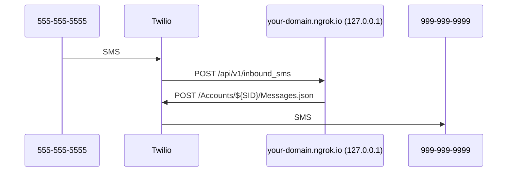

# End-to-end Local Phone Development

Relay uses Twilio HTTP APIs for phone numbers, texts, and calls.
So, a full local end-to-end phone setup works like this:



## Requirements

- Twilio account
- (Suggested) Premium ngrok.com account

## Overview

To make your local Relay SEND messages you will:

1. Create a Twilio account
2. Set up a "main" Relay number in Twilio
3. Send a test message

To make your local Relay RECEIVE messages you will also:

1. Use `ngrok` to publish your local app at a public domain
2. Set up a Relay SMS application in Twilio
3. Receive a test message

### Send messages

#### Create a Twilio account

1. Make a regular Twilio account and "Upgrade" it so you can buy a number.
2. Go to the ["Console"][console] main page
3. Copy the "Account SID" value into your `.env` `TWILIO_ACCOUNT_SID`
4. Copy the "Auth Token" value into your `.env` `TWILIO_AUTH_TOKEN`

[console]: https://console.twilio.com

#### Set up a "main" Relay number in Twilio

Relay sends its own messages to users (e.g., the text message to verify their
real number) from its own "main" phone number. So, you need to buy a main phone
number for Relay and set it to your `TWILIO_MAIN_NUMBER` env var.

1. Go to the ["Buy a number"][buy-number] page in your Twilio account.
2. Buy a number that has Voice, SMS, and MMS capabilities.
3. In your `.env` set `TWILIO_MAIN_NUMBER='<your-number-in-es164-format>'`
   (e.g., +12223334444)

[buy-number]: https://console.twilio.com/us1/develop/phone-numbers/manage/search?frameUrl=%2Fconsole%2Fphone-numbers%2Fsearch

#### Configure local to enable phone features in .env

1. Add `PHONES_ENABLED=True`
2. Add `SUBSCRIPTIONS_WITH_PHONE="relay-phones"`

#### Enable phones for the local user

A feature flag is required to use phones outside of production. This
requirement was added to prevent "subscribing" to the phone service with test
Stripe credentials. Twilio charges for each reserved phone number, even if
Stripe is in testing mode.

To add the required flag for every account:

```sh
./manage.py waffle_flag phones --create --everyone
```

To add the required flag for some accounts, **first sign-in to create the
account**. With the new user's email address, you can then configure the flag
from the command line:

```sh
./manage.py get_or_create_user_group phone_users
./manage.py waffle_flag phones --create --append --group phone_users
./manage.py add_user_to_group user@example.com phone_users
```

#### Send a test message

Now you're ready to send a test message to make sure Twilio is configured
correctly. The first message in the Relay phone flow is the verification code:

1. Sign in at http://127.0.0.1:8000/.
2. Go to [the staging "Relay fonez" purchase page][buy-fonez] and buy a phone
   subscription for the user. (Use a [Stripe testing card][stripe-test-cards] like
   `4242424242424242`)
3. Use the `POST /api/v1/realphone/` API endpoint to trigger a verification
   text message.
   - Go to http://127.0.0.1:8000/api/v1/docs/
   - Scroll down to `POST /realphone/`
   - Click "Try it out"
   - Enter your real number e.g., `{"number": "+12223334444"}` (Remove the
     placeholder `verification_code` property.)
   - Click "Execute" \* You should receive a text message to your real number with a verification
     code.
4. Use the `POST /api/v1/realphone/` API endpoint again to verify your real
   number. This time, submit your real number AND the verification code
   together:
   - `{"number": "+12223334444", "verification_code": "123456"}`

[buy-fonez]: https://accounts.stage.mozaws.net/subscriptions/products/prod_LgQiSgNi4xL7dq
[stripe-test-cards]: https://stripe.com/docs/testing#cards

### Receive messages

#### Use `ngrok` to publish your local app at a public domain

Relay receives webhook requests from Twilio, so your local Relay app needs to
be accessible at a public domain. [`ngrok`][ngrok-download] is a great tool to
make this easier.

1. Follow the instructions on the [ngrok download page][ngrok-download].
2. Put this tunnel config in the `tunnels` section of your
   [`~/.ngrok2/ngrok.yml`][ngrok-config] file:
   ```
   relay:
        proto: http
        addr: 127.0.0.1:8000
        subdomain: pick-a-subdomain
   ```
   Note: You will need ngrok premium to get a static subdomain.
3. Add `your-subdomain.ngrok.io` to your `.env` `DJANGO_ALLOWED_HOST`
4. Set your `.env` `SITE_ORIGIN` to `your-subdomain.ngrok.io`
5. Run `ngrok start relay`
6. Hit https://your-subdomain.ngrok.io/api/v1/docs/ to check that it's working.

[ngrok-download]: https://ngrok.com/download
[ngrok-config]: https://ngrok.com/docs/ngrok-agent/config

#### Set up a Relay SMS application in Twilio

Relay has a webhook URL to receive all text messages sent to all Relay numbers.
Rather than set this webhook URL separately for every Relay number, Relay uses
single SMS application to assign a single webhook URL value for the entire
application. So, you need to create an SMS application in Twilio, assign your
local app URL to its call and text webhooks, and set its app ID to your
`TWILIO_SMS_APPLICATION_SID` env var.

1. Go to the ["TwiML Apps"][twiml-apps] page in your Twilio account.
2. Click the "+" button in the upper-left to create an app.
   - Friendly name: "your-host Relay"
   - Voice request URL: https://your-host.ngrok.io/api/v1/inbound_call HTTP
     POST
   - "Show optional settings"
   - Voice status callback URL: https://your-host.ngrok.io/api/v1/voice_status
   - Messaging request URL: https://your-host.ngrok.io/api/v1/inbound_sms HTTP
     POST
   - "Show optional settings"
   - Messaging status callback URL: https://your-host.ngrok.io/api/v1/sms_status
3. Click "Save"
4. Click the newly-created app
5. Copy the `SID` value into your `.env` `TWILIO_SMS_APPLICATION_SID`

Now, when your Relay app buys mask phone numbers, they will automatically be
configured with the proper webhook URLs for receiving SMS.

[twiml-apps]: https://www.twilio.com/console/sms/runtime/twiml-apps

#### Set up a local Relay number to receive and forward messages

With `ngrok` and Twilio set up, you're now ready to set up a local Relay
number to receive and forward messages to your real phone.

Until the UI flow is done, you'll need to use API endpoints to do this:

1. Go to http://127.0.0.1:8000/api/v1/docs/
2. Scroll down to the `GET /relaynumber/suggestions` endpoint.
3. Click "Try it out"
4. Click "Execute"
5. Scroll thru the `same_prefix_options`, `other_areas_options`
   `same_area_options` and `random_options` numbers and find a
   number you like.
6. Scroll up to the `POST /relaynumber/` endpoint.
7. Click "Try it out"
8. Enter the number you want. E.g., `{"number": "+12223334444"}`
9. Click "Execute"
10. Send a text message to your mask number.

- You should see the Twilio webhook request in your local ngrok and you
  should receive the text message to your real phone!
