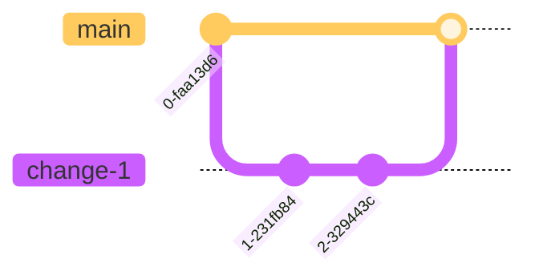
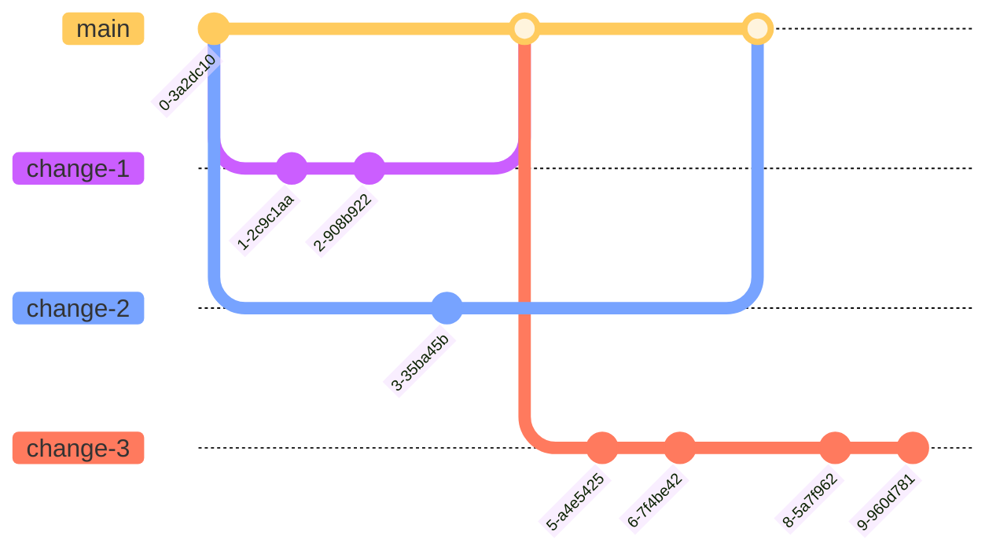
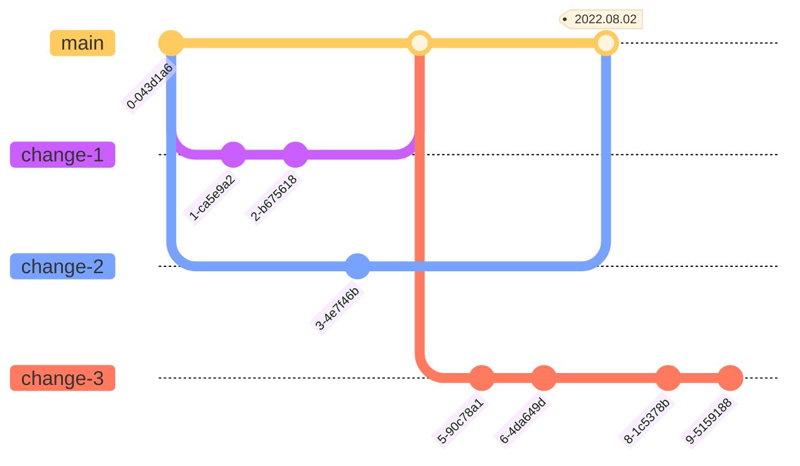
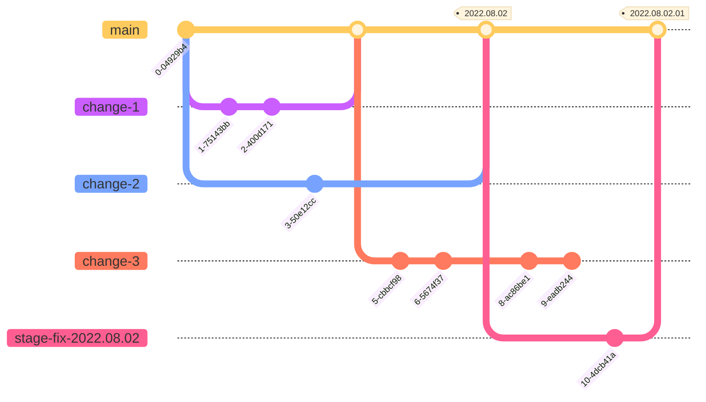
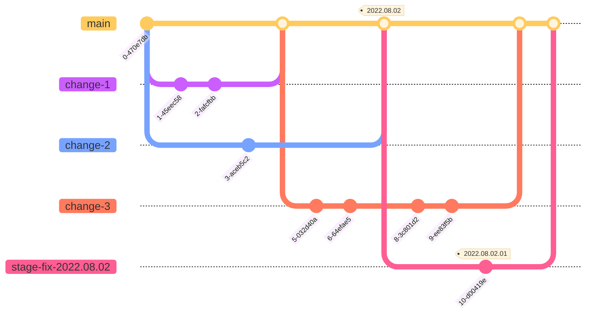

# Release Process

## Environments

- [Production][prod] - Run by SRE team in GCP
- [Stage][stage] - Run by SRE team in GCP
- [Dev][dev] - Run by ENGR team in Heroku
- Locals: Run by ENGRs on their own devices. (See [README][readme] and other [`docs/`][docs].)

## Code branches

Standard Relay development follows a branching strategy similar to
[GitHub Flow][github-flow], where all branches stem directly from `main` and
are merged back to `main`:

1. Create a branch from `main`
2. Make changes
3. Create a pull request to `main`
4. Address review comments
5. Merge pull request

This means many features could be in development at the same time, and all can
merge back to `main` when they are ready.

## Release Timeline

The standard release interval for Relay is 1 week, meaning every week there
will be a new version of the Relay web app on the [Production][prod]
environment. To do this, we first release code to [Dev][dev] and
[Stage][stage].

## Release to Dev

Every commit to `main` is automatically deployed to the [Dev][dev] server, as
long as it can be done with a fast-forward push. Since the
[Great GitHub Heroku Incident of 2022][github-heroku-incident], this is
done from CircleCI using a [service account][service-account].

To push a different branch, you need to add the Heroku app as a remote:

- `heroku login`
- `heroku git:remote -a fx-private-relay`

Then, you can push your local unmerged branch to Heroku:

- `git push -f heroku change-1:main`

Merges to main will fail to deploy until someone manually resets it to `main`:

- `git push -f heroku main`

## Release to Stage

Every tag pushed to GitHub is automatically deployed to the [Stage][stage]
server. The standard practice is to create a tag from `main` every Tuesday at
the end of the day, and to name the tag with `YYYY-MM-DD` [CalVer][calver]
syntax. This tag will include only the changes that have been merged to `main`.
E.g.,

1. `git tag 2022.08.02`
2. `git push --tags`

E.g., the following `2022.08.02` tag includes only `change-1` and `change-2`.

### Create Release Notes on GitHub

After you push the tag to GitHub, you should also
[make a pre-release on GitHub][github-new-release] for the tag.

1. Choose the tag you just pushed (e.g., `2022.08.02`)
2. Type the same tag name for the releae title (e.g., `2022.08.02`)
3. Click "Previous tag:" and choose the tag currently on production.
   - You can find this at [the `__version__` endpoint][prod-version].
4. Click the "Generate release notes" button!
5. Check the pre-release box.
6. Click "Publish release"

## Release to Prod

We leave the tag on [Stage][stage] for a week so that we (and especially QA)
can check the tag on GCP infrastucture before we deploy it to production. To
deploy the tag to production:

1. File an [SRE ticket][sre-board] to deploy the tag to [Prod][prod].
   - Include a link to the GitHub Release
   - You can assign it directly to our primary SRE for the day
2. When SRE starts the deploy, "cloudops-jenkins" will send status messages
   into the #fx-private-relay-eng channel.
3. When you see `PROMOTE PROD COMPLETE`, do some checks on prod:
   - Spot-check the site for basic functionality
   - Check [sentry prod project](https://mozilla.sentry.io/releases/?environment=prod) for a spike in any new issues
   - Check [grafana dashboard](https://earthangel-b40313e5.influxcloud.net/d/qiwPC76Zk/fx-private-relay?orgId=1&refresh=1m&from=now-1h&to=now) for any unexpected spike in ops
   - [Run end-to-end tests](https://github.com/mozilla/fx-private-relay/actions/workflows/playwright.yml) on prod (Note: as of 2023-07-12 these are known-broken. 😢)
4. Update the GitHub Release from "pre-release" to a full release and reference the production deploy SRE Jira ticket.

## Stage-fixes

Ideally, every change can ride the regular weekly release "trains". But
sometimes we need to make and release changes before the regularly scheduled
release.

### "Clean `main`" flow

If a bug is caught on [Stage][stage] in a tag that is scheduled to go to
[Prod][prod], we need to fix the bug before the scheduled prod deploy. If
`main` is "clean" - i.e., nothing else has merged yet, we can use the regular
GitHub Flow:

1. Create a stage-fix branch from the tag. E.g.:
   - `git branch stage-fix-2022.08.02 2022.08.02`
   - `git switch stage-fix-2022.08.02`
2. Make changes
3. Create a pull request to `main`
4. Address review comments
5. Merge pull request
6. Make and push a new tag. E.g.: `2022.08.02.01`

### "Dirty `main`" flow

If a bug is caught on [Stage][stage] in a tag that is scheduled to go to
[Prod][prod], we need to fix the bug before the scheduled prod deploy. If
`main` is "dirty" - i.e., other changes have merged, we can make the new tag
from the stage-fix branch.

1. Create a stage-fix branch from the tag. E.g.:
   - `git branch stage-fix-2022.08.02 2022.08.02`
   - `git switch stage-fix-2022.08.02`
2. Make changes
3. Create a pull request to `main`
4. Address review comments
5. Merge pull request
6. Make and push a new tag _from the `stage-fix` branch_

### Creating GitHub Release Notes for stage-fix release

Whether you make a "clean" or "dirty" stage-fix, after you push the new tag to
GitHub, you should [make a pre-release on GitHub][github-new-release] for the
new release tag.

1. Choose the tag you just pushed (e.g., `2022.08.02.01`)
2. Type the same tag name for the releae title (e.g., `2022.08.02.01`)
3. Click "Previous tag:" and choose the previous tag. (e.g., `2022.08.02`)
4. Click the "Generate release notes" button!
5. Check the pre-release box.
6. Click "Publish release"

## Example of regular release + "clean" stage-fix release + regular release

## Future

Since the "clean main" flow is simpler, we are working towards a release
process where `main` is _always_ clean - even if changes have been merged to
it. To keep `main` clean, we will need to make use of feature-flags to
effectively hide any changes that are not ready for production. See the
[feature flags][feature-flags] docs for more.

When we are confident that `main` can always be released, we may get rid of
release tags completely, and move to something more like a GitLab Flow where we
merge from `main` to long-running branches for `dev`, `stage`, `pre-prod`, and
`prod` environments.

[prod]: https://relay.firefox.com/
[stage]: https://stage.fxprivaterelay.nonprod.cloudops.mozgcp.net/
[dev]: https://dev.fxprivaterelay.nonprod.cloudops.mozgcp.net/
[readme]: https://github.com/mozilla/fx-private-relay/blob/main/README.md
[docs]: https://github.com/mozilla/fx-private-relay/tree/main/docs
[github-flow]: https://docs.github.com/en/get-started/quickstart/github-flow
[github-heroku-incident]: https://blog.heroku.com/april-2022-incident-review
[service-account]: https://mana.mozilla.org/wiki/display/TS/List+of+Heroku+service+accounts
[calver]: https://calver.org/
[sre-board]: https://mozilla-hub.atlassian.net/jira/software/c/projects/SVCSE/boards/316
[github-new-release]: https://github.com/mozilla/fx-private-relay/releases/new
[prod-version]: https://relay.firefox.com/__version__
