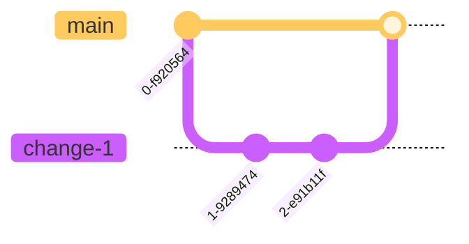

# Release Process

## Environments

- [Production][prod] - Run by ENGR team in GCP
- [Stage][stage] - Run by ENGR in GCP
- [Dev][dev] - Run by ENGR team in MozCloud
- Locals: Run by ENGRs on their own devices. (See [README][readme] and other [`docs/`][docs].)

## Code branches

Standard Relay development follows a branching strategy similar to
[GitHub Flow][github-flow], where all branches stem directly from `main` and
are merged back to `main`:

1. Create a branch from `main`
2. Make changes
3. Create a pull request to `main`
4. Address review comments
5. Merge pull request



This means many features could be in development at the same time, and all can
merge back to `main` when they are ready.


## Release Timeline

The standard release interval for Relay is 1 week, meaning every week there
will be a new version of the Relay web app on the [Production][prod]
environment. To do this, we first release code to [Dev][dev] and
[Stage][stage].

## Release strategy

Our ["Deploy to MozCloud environment" workflow][release-workflow] builds and tags Docker container images
such that newly built images are picked up by our auto-synced ArgoCD dev/stage/prod applications.
Each environment filters for certain tags that it is allowed to deploy.

The tag structure is as follows:

| Environment | Allowed Tags                           |
| ----------- | -------------------------------------- |
| dev         | `10digitSHA--dev` or `YYYY.MM.DD--dev` |
| stage       | `YYYY.MM.DD--stage`                    |
| prod        | `YYYY.MM.DD--prod`                     |

All code that is pushed to `main` will auto-deploy to the `dev` environment. To manually deploy a change, you can use the ["Deploy to MozCloud environment" workflow][release-workflow] to select a branch/tag to deploy:

[
](./img/gha-deploy-mozcloud.png)

**Note: There will be a slight delay between the action finishing and the actual deploy. This is because the action builds an image that is automatically picked up by ArgoCD. A bot will update the `#fx-private-relay-eng` when the deploy actually goes out.**

## Release to Dev

Every commit to `main` is automatically deployed to the [Dev][dev] server.

To deploy an alternate branch or tag to the `dev` environment, use the ["Deploy to MozCloud environment" workflow][release-workflow]
in Github and select the branch or tag that you wish to deploy, along with the `dev` environment. See the "Release to Stage" section below for a screenshot.

Note that if your branch or tag has migrations, they will be run automatically. This might cause conflicts
that need to be manually fixed in `dev` later on.

## Release to Stage

The standard practice is for the Base Load Engineer to create a tag from `main` every Tuesday at
the end of the day, and to name the tag with `YYYY.MM.DD` [CalVer][calver]
syntax. This tag will include only the changes that have been merged to `main`.
E.g.,

1. `git tag 2022.08.02`
2. `git push --tags`

E.g., the following `2022.08.02` tag includes only `change-1` and `change-2`.


Once you've created the tag, you should use the ["Deploy to MozCloud environment" workflow][release-workflow]
to select the tag and deploy to the [Stage][stage] environment by selecting `stage`.

### Create Release Notes on GitHub

After you push the tag to GitHub, you should also
[make a pre-release on GitHub][github-new-release] for the tag.

1. Choose the tag you just pushed (e.g., `2022.08.02`)
2. Type the same tag name for the release title (e.g., `2022.08.02`)
3. Click "Previous tag:" and choose the tag for comparison.
   - If the last release was a standard release, use the release currently on production.
     You can find this at [the `__version__` endpoint][prod-version].
   - If the last release was a hot fix, use the "regular" release before the hot fix.
     For example, if the current release is `2022.08.02.1`, use `2022.08.02` as the
     previous release.
4. Click the "Generate release notes" button!
5. Edit the generated notes to add a planned release summary and organize PRs
   into sections, such as:

   ```text
   Planned for release to relay.firefox.com on August 9th, 2022.

   ## User-facing changes
   * PRs that will change what users see, good candidates for QA tests

   ### Upcoming Features
   * PRs that are behind feature flags, if any, with note: (behind flag `the_flag_name`)

   ## Other changes
   * PRs for backend changes, documentation, etc

   ## Dependency updates
   * All the Dependabot PRs

   **Full Changelog**: Keep the link generated from the automated GitHub release generation.
   ```

6. Check the pre-release box.
7. Click "Publish release"

## Release to Prod

We leave the tag on [Stage][stage] for a week so that we (and especially QA)
can check the tag on GCP infrastructure before we deploy it to production.

On Tuesday, after the Release Readiness review with QA:

1. Use the [release workflow][release-workflow] to select the tag and deploy
   to the [Prod][prod] environment by selecting `prod`.
2. Once the GitHub action finishes- go to ArgoCD an click "Sync" in the production application.
3. When you see `Application relay... is now running new version of deployments manifests.` in `#fx-private-relay-eng` on Slack, do some checks on prod:
   - Spot-check the site for basic functionality
   - Check [sentry prod project](https://mozilla.sentry.io/releases/?environment=prod) for a spike in any new issues
   - Check [grafana dashboard](https://yardstick.mozilla.org/) for any unexpected spike in ops
   - (optional) [Run the relay-only e2e test suite](https://github.com/mozilla/fx-private-relay/actions/workflows/playwright.yml) on prod
4. Update the GitHub release:
   - Update the summary:

     ```text
     Released to relay.firefox.com on August 9th, 2022 with SVCSE-1385.
     ```

   - De-select "Set as a pre-release",
   - Select "Set as the latest release"
   - Click "Update release"

## Stage-fixes

Ideally, every change can ride the regular weekly release "trains". But
sometimes we need to make and release changes before the regularly scheduled
release.

### "Clean `main`" flow

If a bug is caught on [Stage][stage] in a tag that is scheduled to go to
[Prod][prod], we need to fix the bug before the scheduled prod deploy. If
`main` is "clean" - i.e., nothing else has merged yet, we can use the regular
GitHub Flow:

1. Create a stage-fix branch from the tag. E.g.:
   - `git branch stage-fix-2022.08.02 2022.08.02`
   - `git switch stage-fix-2022.08.02`
2. Make changes
3. Create a pull request to `main`
4. Address review comments
5. Merge pull request
6. Make and push a new tag. E.g.: `2022.08.02.1`


### "Dirty `main`" flow

If a bug is caught on [Stage][stage] in a tag that is scheduled to go to
[Prod][prod], we need to fix the bug before the scheduled prod deploy. If
`main` is "dirty" - i.e., other changes have merged, we can make the new tag
from the stage-fix branch.

1. Create a stage-fix branch from the tag. E.g.:
   - `git branch stage-fix-2022.08.02 2022.08.02`
   - `git switch stage-fix-2022.08.02`
2. Make changes
3. Create a pull request to `main`
4. Address review comments
5. Merge pull request
6. Make and push a new tag _from the `stage-fix` branch_


### Creating GitHub Release Notes for stage-fix release

Whether you make a "clean" or "dirty" stage-fix, after you push the new tag to
GitHub, you should [make a pre-release on GitHub][github-new-release] for the
new release tag.

1. Choose the tag you just pushed (e.g., `2022.08.02.1`)
2. Type the same tag name for the release title (e.g., `2022.08.02.1`)
3. Click "Previous tag:" and choose the previous tag. (e.g., `2022.08.02`)
4. Click the "Generate release notes" button!
5. Check the pre-release box.
6. Click "Publish release"

## Example of regular release + "clean" stage-fix release + regular release


## Future

Since the "clean main" flow is simpler, we are working towards a release
process where `main` is _always_ clean - even if changes have been merged to
it. To keep `main` clean, we will need to make use of feature-flags to
effectively hide any changes that are not ready for production. See the
[feature flags][feature-flags] docs for more.

When we are confident that `main` can always be released, we may get rid of
release tags completely, and move to something more like a GitLab Flow where we
merge from `main` to long-running branches for `dev`, `stage`, `pre-prod`, and
`prod` environments.


[prod]: https://relay.firefox.com/
[stage]: https://relay.allizom.org
[dev]: https://relay-dev.allizom.org/
[readme]: https://github.com/mozilla/fx-private-relay/blob/main/README.md
[docs]: https://github.com/mozilla/fx-private-relay/tree/main/docs
[github-flow]: https://docs.github.com/en/get-started/quickstart/github-flow
[calver]: https://calver.org/
[sre-form]: https://mozilla-hub.atlassian.net/jira/software/c/projects/SREIN/form/1344
[github-new-release]: https://github.com/mozilla/fx-private-relay/releases/new
[prod-version]: https://relay.firefox.com/__version__
[feature-flags]: ./feature_flags.md
[release-workflow]: https://github.com/mozilla/fx-private-relay/actions/workflows/deploy-mozcloud.yml
