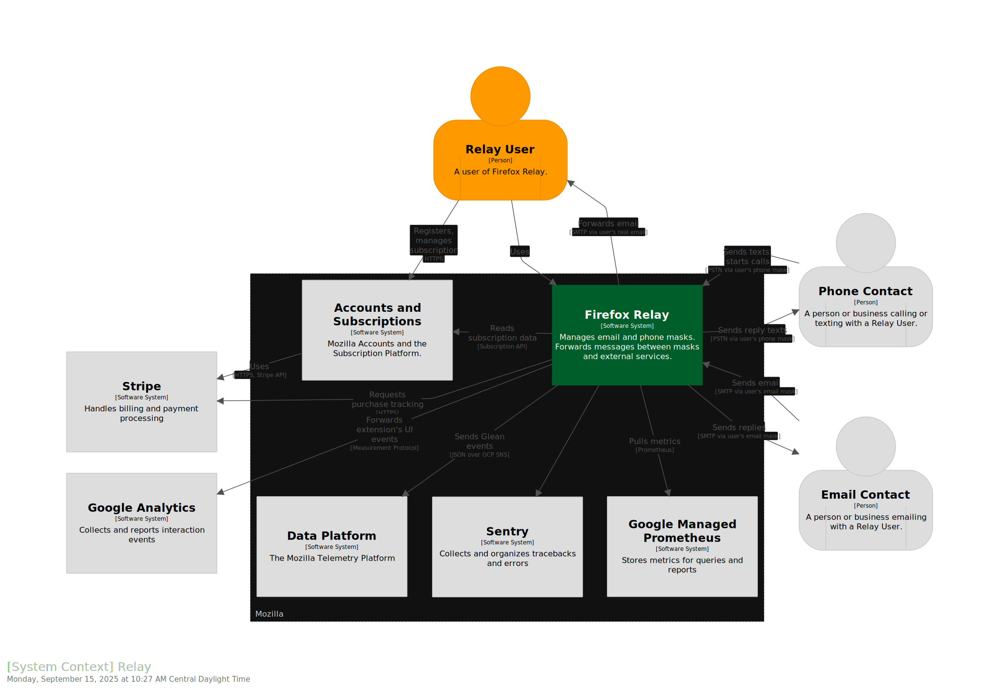
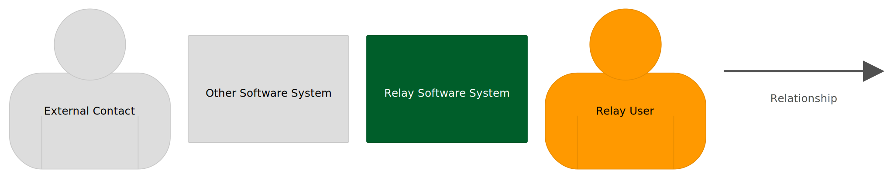
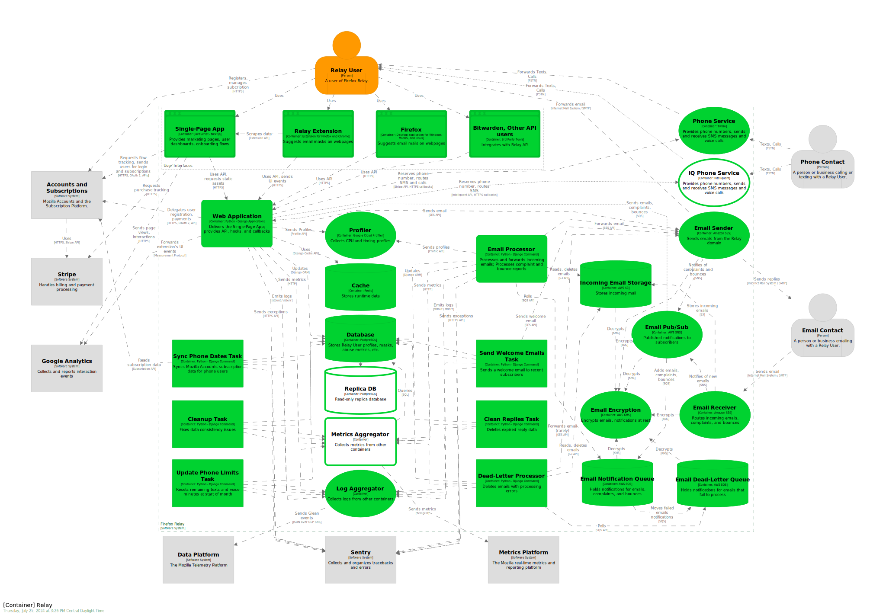
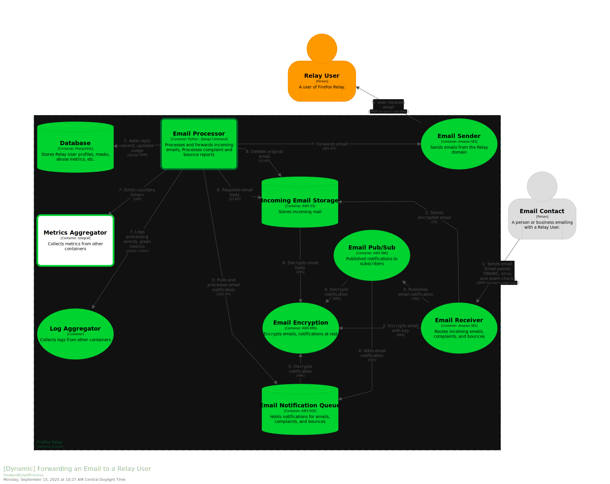
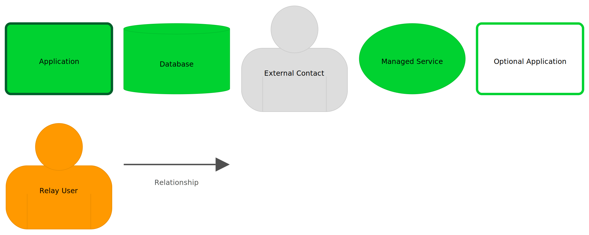
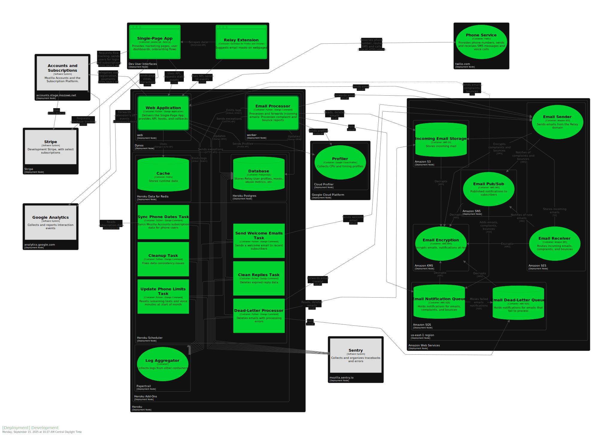
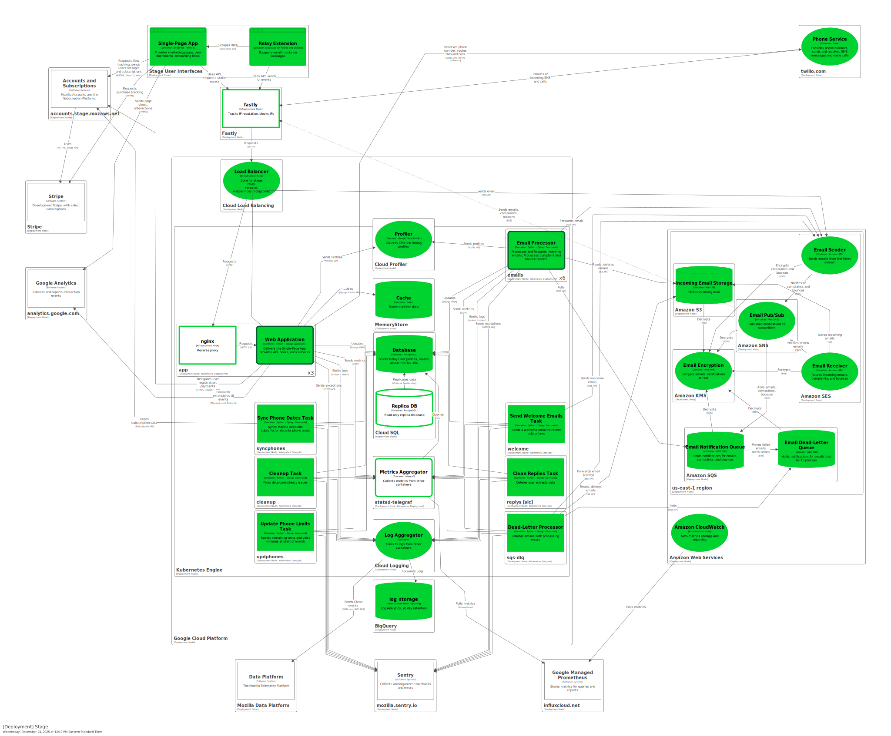
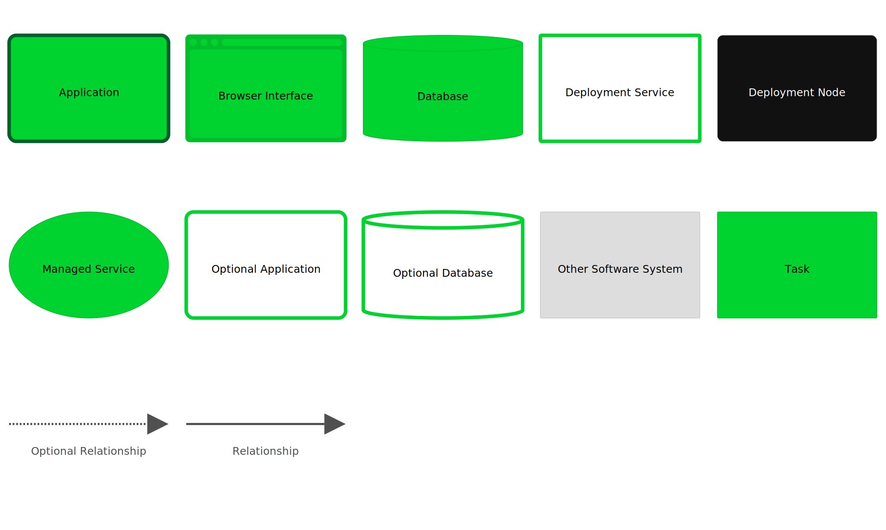

<!-- vim: set textwidth=88 ft=markdown syntax=markdown -->

# System Diagrams

This folder contains system diagrams for Relay, as well as the source model and
scripts to generate the diagrams.

The model currently includes the top two levels of the [C4 Model][]: System
Context and Containers.

## System Context Diagram

This shows the relationships between the Relay software system, other software systems,
and users.

Key:

## Containers Diagram

This shows the relationships between the containers (independently deployed parts) of
Relay and the other software systems.

Key:

# Dynamic Diagrams

Dynamic Diagrams show how data and actions move between components.

## Forwarding an Email to a Relay User

This diagram shows the "happy path" of an incoming email being forwarded to a Relay user.

Key:

# Deployment Diagrams

Deployment diagrams have the details of how containers are deployed, along with
additional services for the deployment environment.

## Development Deployment Diagram

The development deployment is hosted in Heroku and AWS. Deployments are done by Relay
developers, by pushing a branch to Heroku.

The Dev Deployment lacks some of the full Relay System features:

- Logs are not forwarded to the data platform
- Metrics are disabled
- Firefox does not integrate with this deployment
- There are no other API users (as far as we know)

The Dev Deployment has some additional features:

- The Inteliquent service is enabled as an alternate phone provider

Key:

## Stage Deployment Diagram

The stage deployment is hosted in GCP and AWS. Deployments are done by Jenkins
when a new tagged Docker image is published.

The Stage Deployment lacks some of the full Relay System features:

- Firefox does not integrate with this deployment
- There are no other API users (as far as we know)

The Stage Deployment has some additional features:

- There is a read-only replica of the database
- There is a canary app deployment. This single pod is updated first, so that any errors
  will halt the full deployment.
- The Metrics Aggregator (statsd-telegraf) queries the database periodically
- The stackdriver-telegraf service queries the GCP Cloud Metrics periodically

Key:

## Production Deployment Diagram

The production deployment is hosted in GCP and AWS. Deployments are done by Jenkins
when an SRE continues a stage deploy.

The Production Deployment has some additional features:

- There is a canary app deployment. This single pod is updated first, so that any errors
  will halt the full deployment.
- The Metrics Aggregator (statsd-telegraf) queries the database periodically
- The stackdriver-telegraf service queries the GCP Cloud Metrics periodically
- There is a read-only replica of the database
- There is a canary app deployment. This single pod is updated first, so that any errors
  will halt the full deployment.

Key:

# Tools: C4 and Structurizr

The Relay architecture is modelled using the [C4 Model][] for visualising
software architecture, created by [Simon Brown][]. The diagrams are generated
using [Structurizr][]. `workspace.dsl` is written in [Structurizr DSL][].
[Structurizr Lite][] is a dockerized web service for viewing and laying out the
diagrams. `workspace.json` has the details of the layout.

Mozilla Accounts is an early adopter of the C4 Model. See:

- [Ecosystem Platform: System Diagrams](https://mozilla.github.io/ecosystem-platform/reference/system-diagrams)
- [ecosystem-platform/architecture-diagrams](https://github.com/mozilla/ecosystem-platform/tree/master/architecture-diagrams)
- [fxa/docs/adr/0034-use-structurizr-diagrams.md](https://github.com/mozilla/fxa/blob/main/docs/adr/0034-use-structurizr-diagrams.md)

[C4 Model]: https://c4model.com/
[Simon Brown]: https://simonbrown.je/
[Structurizr]: https://structurizr.com/
[Structurizr DSL]: https://docs.structurizr.com/dsl
[Structurizr Lite]: https://docs.structurizr.com/lite

## Updating diagrams

The file `workspace.dsl` contains the model, written in [Structurizr DSL][]. The file
`workspace.json` contains the layout details.

To update the diagrams:

- Install [Docker][], such as Docker Desktop for Mac
- Run `./run_structurizr_lite.sh`
- Go to <http://127.0.0.1:8080/> in a browser
- Make changes to `workspace.dsl`. Refresh the page or use the "home" button to reload
  the model.
- Adjust the layout in the webapp
- Export the SVG images and move to the `img`, replacing existing images
- Check in `workshop.dsl`, `workshop.json`, and any changed images

[Docker]: https://www.docker.com/
